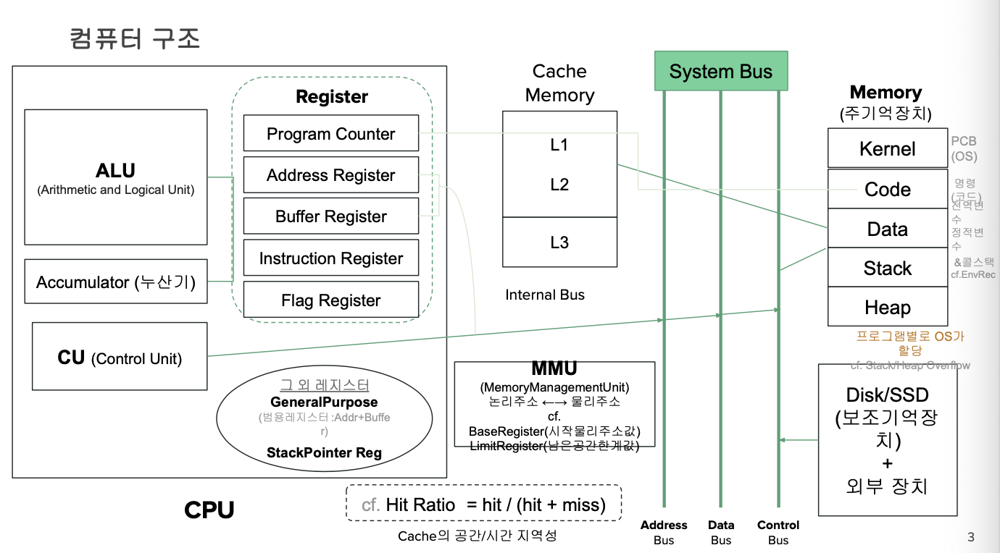
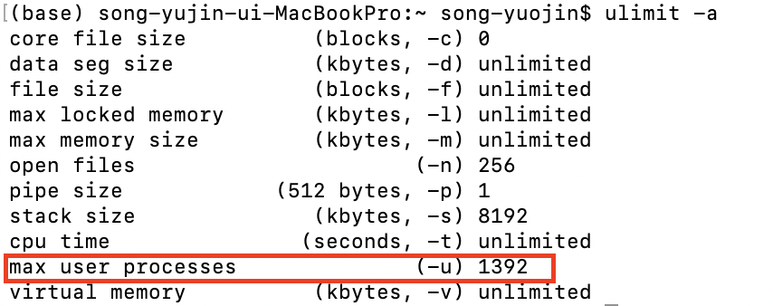
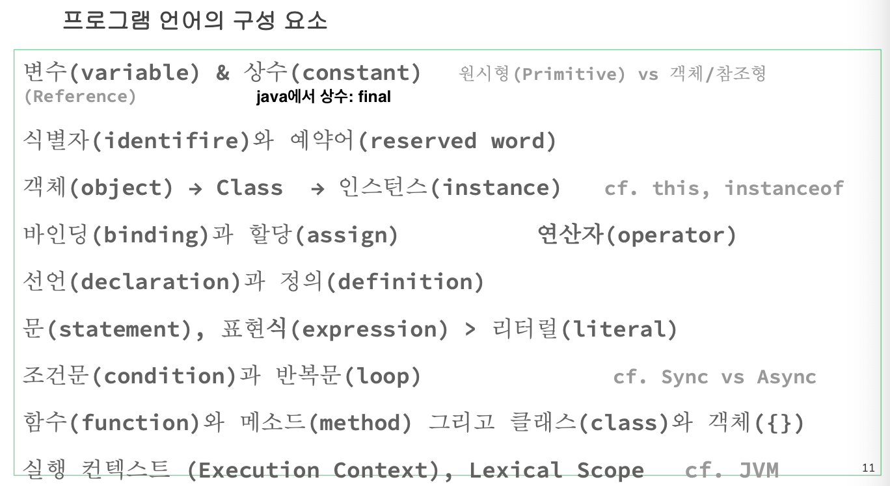

# 컴퓨터 구조

Tags: VM, compile, linking, os, 컴파일러, 컴퓨터 아키텍처
Start Date: 2024년 5월 2일

내부를 이해해야함, 어떻게 돌아가느냐

리액트를 어떻게 만들 것이냐

자체 프레임워크: 페이스북, 네이버, 카카오 등 → 프레임워크를 개발하는 개발자: 상위 1% → 엔진에 대한 지식이 뛰어남

protocol: 컴퓨터 규약

## 컴퓨터 구조



- 프로세스/앱이 어떻게 구동되는지
- 마더보드 안에 CPU, Memory(주기억 장치)+캐시메모리, 보조기억장치(SSD), VGA(비디오카드)+GPU, LAN(여러개, 무선, 유선), LT(키보드, 마우스 등)
    - cpu-memory, cpu-ssd 사이에 Bus(넙적한 선) 있음 : 데이터, 명령어 이동함
    - os: 64bit, 32bit → bus 갯수
    - cpu, memory, bus, lan → 컴퓨터 속도를 좌우함
    - gpu: 짐을 싣는다 ex) 1톤 트럭, 10톤 트럭 속도는 1톤이 빠름 → 10톤 트럭: 병목현상 생김
    - 8bit = 1byte
    - cell 하나에 2^5(32bit)/ 2^6(64bit)
    - 색표현: 255*255*255+opacity(투명도) → 이 연산이 복잡하네? → GPU 쓰자(비디오카드)
    - 인공지능에서 gpu를 많이 사용하는 이유: 컴퓨터 언어인 2진수를 계산하는게 빠름, 학습시키는 모든 데이터가 2진수임, 비슷한 2진수 배열을 학습한다고 보면 됨, 단어도 2진수로 바꿔서 계산(A = 65)
    - IDC(데이터센터)는 cpu 열 관리가 중요해서 추운 해저에 많이 심음

### 요즘 쓰는 cpu

- cpu 안에 캐시 메모리가 들어가 있음
- 양자 컴퓨터: 데이터가 2진수가 아니어서 훨씬 빠름, 복호화도 빠름, 소수를 사용
- 생각만 하는 느낌 ex. 물마시러 가야지
- 실행은 메모리가 함
- cpu 종류: CISC, RISC
    - CISC : 명령어 길이가 가변적, hw 비중이 큼
    장점: 컴파일러 작성 쉬움, 호환성 좋음
    단점: 디코딩 오래걸림, 명령어 길이가 달라서 여러개 명령어 처리 어려움
    - RISC: 고정된 명령어 길이 사용, sw 비중이 큼, 대표적으로 ARM
    장점: 프로그램 짜기 힘듬, 속도 빠름, 여러개 명령어 처리 가능
    단점: 명령길이 고정으로 코드효율 낮음
    - 요즘은 각각의 장점을 합해서 사용하는 경우가 많음

### 레지스터(8개)

- cpu가 쓰는 메모리
- 캐시, 주기억 보다 빠름
- 용도가 다른 8개 레지스터들에 잠깐 잠깐 담아둔다. (ex. 앞접시)
- program counter: 명령어가 실행될때 다음에 해야하는 행동을 알려줌
- address register
- flag register: 0/1 표현
- buffer register: 임시로 담아둘 데이터

### 캐시메모리

- 자주 쓰니까 옆에 두고 쓴다
- 이제는 캐시메모리를 자주쓰다보니 cpu에 점점 가까워 져서 L1, L2, L3 다 cpu에 들어가 있음
- ex. 텀블러에 물 담아놓고 옆에 두는거처럼
- 버스 안타고 바로 갈 수 있는 자주쓰는 메모리들
- 사이즈: L1 < L2 < L3 → L1을 가장 자주 사용

### 보조기억장치(disk, ssd)

- 주기억에 올라가는 것 bus 타고 감: cpu가 함
- 속도는 주기억장치보다 느림
- ex. 자주 안보는 영화

### 주기억장치(memory)

- 컴퓨터 끌 때까지(프로세스 종료) 영구적인 데이터
- 구역(context)가 나눠져있음
- 코드를 실행하면 cpu가 각 구역별 내용을 주기억장치로 올려줌
- kernel
- code: 내가 작성하는 코드(함수, 명령어), 한번이라도 컴파일 된거(목적코드라도)
- data: 변하지 않는 데이터(const)
- stack: 목차 부분, 사이즈가 정해진 데이터(data type 있음: int, double)
- heap: 데이터 부분, 사이즈가 정해지지 않은 데이터(String)

```c
int i = 10;
// int: 데이터타입, 크기: 4B(2^32 = 42억정도)
// i: 식별자, 변수, int i는 43억을 못가짐
// 10: 값(literal)

double d = 100;
// double: 크기: 8B(2^64)
// i, d 메모리 나눠 가짐
// i, d 각각 메모리 주소를 가짐 -> &i = 100, &d = 104 (목차 개념)
// 메모리공간, 주소공간 생김
// i, d 는 stack에 있음 -> 4B, 8b로 길이 정해짐

String s = 'ABC';
// 2^8 = 256
// A = 65, B = 66, C = 67 -> 각각 1B 안에 표현 가능 -> 총 3B 필요
// &A = 100, &B = 101, &C = 102 하고 끝이 아니라 null 까지 읽음
// s는 heap에 있음 -> 언제든 길이가 변할 수 있어서 크기가 정해지지 X
// ex. i = 100으로 바껴도 크기가 변하진 않음/ s = 'ABSER"로 바뀌면 5B 필요

const c = 100;
// const: 고정값, 상수 -> data 영역에 있음

function add(a, b){
    return a+b;
}
// 함수/명령어들도 메모리에 있어야 실행하니까 -> code 영역
```

### ALU (Arithmetic and Logical Unit)

- 연산을 하는 장치
- 컴퓨터는 기본적으로 더하기 밖에 못함 (ex. 6/2 = 6+(-3)+(-3))
- 곱하기, 나누기는 논리 연산을 함 (OR, AND, XOR, NOR, NAND 등)

### Accumulator(누산기)

- 이전 값을 잠깐 담아두는 곳
- 기술 발전 → 2~4개 까지 둠 (2주소 방식, 4주소 방식)
- [명령어 구조](https://www.notion.so/9cd673efc375473488e3fbb4b8c9c2bd?pvs=21)를 보자

```c
a = 1+2; // a=3을 누산기에 잠깐 담아둠
b = a+3; // 메모리까지 가지 않고 누산기에 있는 a를 가져옴
// 누산기 -> 실행이 빨라짐
```

### CU (control unit)

- bus를 통해 코드를 찾아옴
    1. address bus: 주소 필요
    2. data bus: 명령어 필요
    3. control bus: 명령이 어떤 동작을 해? 코드 줘
    4. 메모리에서 코드 찾음
    5. control bus: 나 돌아가
    6. data bus: add 코드 들어있어
    7. address bus: add 함수 주소 있어
- CU는 program counter만 보고 움직임: program counter가 명령어 실행 순서를 알고 있음  ex. 1-1(a=1) → 1-2(a한테 2줌) → 1-3(b에 담음)
- 사람이 쓴 코드를 컴파일 하면 → 컴퓨터가 이해하는 코드: 명령어 구조

### MMU (Memory Management Unit)

- 논리주소 ↔ 물리주소
- **hello.c, hello.java**: source code 
→ `컴파일`
**hello.o, hello.class**: 기계어(2진수), object code(목적코드) 
→ `linking` or `VM` or `Runtime`
**hello.exe**: **ML (OS, cpu):** 기계어
- linking
    - 링킹할 때 메모리 주소를 만듦
    
    ```c
    int a, b, c, d;  // 4B 4개 -> 16B 필요
    // 컴파일할때 물리적이 위치가 정해짐
    // 기준 주소는 os가 줌
    // a: &0, b: &4, c:&8, d:&12 -> 논리주소
    // a: &100, b: &104, c:&108, d:&112 -> 물리주소(실제 존재)
    // program register는 0번지로 알고 있지만 MMU가 실제주소인 100번지를 알고 있음
    ```
    

### Hit Ratio

- hit / (hit + miss)
- 눈감고 집었는데 내가 딱 원하는 걸 잡은 경우
- miss 보다 hit 할 확률이 높으면 효율 올라감
- hit ratio 증가 → 연산 속도 증가 → 메모리 가는 경우 줄어듬
- hit ratio 고려해서 코드를 짜야 좋은 코드
- 컴파일을 잘해주면(지금 쓰는 4세대 프로그래밍 언어) 코드를 대충짜도 잘 해주지

## 명령어 구조


- 명령어는 기계어마다 다름 → CPU 만든 사람 마음 (intel, mac 등)
- 명령어로만 하는 코딩 = 1세대 언어: 어셈블리어
    - 2세대 언어: c
    - 3.5세대 : python, js
- Operation Code(4bit)
- Operande(6*2 bit)

```c
//operation code  operand
add 1 2
mv a     // 누산기에 a = 3 담음
add a 2
mv b     // 누산기에 b = 5
```

## OS

HW를 operating system

os를 구동하기 위해 programing code(source code)가 필요

cpu가 이해할 수 있는 코드를 작성해야함

반도체 판 안에 다 os가 있음  ex. imbeded linux, android, chronium(키오스크) 등

os runtime: 실행, node v22, chrome

os engine: 실행 환경, ecma2021

runtime이 engine을 품고 있음

ex. JVM ; JDK(library) JRE(java runtime)

### CMOS = ROM BIOS

- CMOS → booting → window/mac
- CMOS(ROM): 마더보드에 있는 메모리
    - read only memory
    - 비휘발성, 읽기만 가능
    - hw 정보들: 몇기가, 키보드, 비디오/사운드 카드, gpu 정보 등이것저것 담겨있음
- RAM
    - random acess memory
    - 휘발성
- Kernel
    - 펌웨어에 가까움 hw에 가까운 프로그램
    - hw를 컨트롤 하기 위한 os의 engine
    - hw ↔ sw
    - cmos에 있는 데이터를 memory(RAM)으로 가져옴
    - 응용sw, 시스템 sw, 펌웨어, hw 를 다 control 함
    - 미러링: c드라이브, d드라이브가 있을 때 c를 그대로 d로 복제 → c 메모리가 날라갈 경우를 대비
    - 리눅스에는 FAT과 NFS가 있고 요즘은 다 NFS 씀
        - 서버형 리눅스: RedHat(유료; 기업에서 사용), CentOS(개발자가 다 관리해야함), PC형 리눅스: Ubunto
        - WSL(window server linux): linux 명령어를 실행시킴 → 실행시킬 linux kernel이 필요함
- 가상 메모리
    - 스와핑: 실제 메모리와 가상메모리 왔다갔다 하는 것
    많아지면 느려짐(병목현상), 보조메모리가 주메모리보다 느려서 → ZRAM(메모리 압축해서 용량 감소)
    - fragmentation(단편화): 데이터를 담을 때 빈공간이 생기는 경우, 낭비되는 공간들
    - paging: 8/16kB 사이즈로 공간 나눔 → 빈공간은 생기지만 찾기는 빠름 (ex. 서랍정리)
    - garbage collector:
- DRAM: 메모리 주소 변형이 일어남, 느림, RAM에 붙어있음
- SRAM: 빠름, 비쌈, Cache에 붙어있음

### VM/Engine 과 Runtime/Environment

| VM
(JVM = java VM) | Virtual Machine/ Engine
Runtime/ Environment | runtime: object code를 기계어로 바꾸는 과정
*engine, runtime 차이 중요 |
| --- | --- | --- |
| OS |  |  |
| HW |  |  |

**compiler vs interpreter**

- compiler 언어: 한번에 전체 통역
- interpreter 언어: 실시간 한줄씩 통역, 상황에 따라 바뀔 수 있어서 유연성이 있음, AI 언어처럼
- 두 언어 모두 compile을 하지만 컴파일 하는 방식이 다름
- 대부분의 언어가 interpreter 언어로 바뀌고 있음 → 그래서 JVM라는 언어를 바꿔주는 VM이 필요함
    - java는 반반 가지고 있음

**절차형 언어 vs 함수형 언어**

- 절차형, 함수형 모두 객체지향 언어임, class를 함수로 가는 바로가기 링크라고 생각함면 됨
    - 함수 → 함수 vs 생성자 함수: new f(); `new`를 붙여주면 생성자 함수
- 절차형 언어: 대부분 compiler 언어, 명령형, 각본대로 진행, class/interface로 객체지향을 표현 (c는 class가 없기 때문에 객체지향이 아님)
    
    ```c
    for(i=1, 100, i++)
        if (i%2 == 1)
            더해
            
    1. 물 끓여
    2. 스프 넣어
    3. 면 넣어
    4. 계란 넣어
    ```
    

- 함수형 언어: 대부분 interpreter 언어, 선언형, 만들기 어럽지만 수정이 용이함, 함수로 객체지향을 표현
    
    ```c
    loop(i=1, 100, i++)
        더해 if (i%2 == 1) // 더해 뒤를 상황에 따라 바꿀 수 있음
        
    넣어 (스프)
    넣어 (면) -> 넣어 (반 쪼개 면) -> 반 쪼개라는 함수도 만들 수 있음
    => x = g(넣어, 반, 넣어)
    => x(스프, 면, 계란)
    ```
    
- 영한 변역이 좋아진 이유: 한국어 ↔ 일어/중국어 ↔ 영어 **←** **VM도 이런 역할**
- c, linux 등은 어디서 컴파일 했느냐에 따라 실행가능한 곳이 한정되는데 java는 JVM을 사용함으로써 제한이 없어짐
- 우리가 사용하는 브라우저들에는 모두 Html/CSS/JS Runtime이 들어있음

```jsx
a.js

i = 1 //0번지

a.obj
메모리 주소 정렬
// i는 그대로 0번지
// 옮겨진 주소들을 다 전달받음
i, j // stack에 있음

$> node a.js  // 명령어 실행
// node = Engine + Runtime
// a.js: 잠수함
// engine: 잠수함 부품; console 등
// runtime: 바다, 조립해서 바로 실행
// node, dno
```

```jsx
b.js

j = 2  //0번지

b.obj
// 0번지가 겹치니까
// j -> 10번지로 이동시킴
// console -> 100번지
```

- 객체지향 vs 절차지향
    
    ```jsx
    //객체지향 - python
    Dog() = 개를 구성하는 명령들
    Bbobbi = new Dog(); // 선언형
    
    //절차형 - c, java
    다리 4개
    멍멍
    .
    .
    .
    
    // 위에 코드는 속도가 같음 -> 함수 선언하면 절차형이 함수안에 들어있으니까
    // 실행(start)은 함수형이 빠름 - 메모리를 안잡고 엔진에 대한 것만 잡으면 되니까
    // 실행은 절차형이 느림 - 메모리를 한번에 다 잡아야하니까
    ```
    
- interface
    
    ```jsx
    x = new 붕어빵();  // new: 생성자 함수
    y = new 붕어빵();
    // x, y: 먹을 수 있는 거
    // 붕어빵(): x, y를 만들 수 있는 틀
    ```
    

### Process vs Thread

- node 가 실행되면 process(cpu가 수행하는 연산) 형태로 있음
clock이 구동되면 마더보드의 timer가 작동됨
- **process**: cpu가 일하고 있는 것, cpu 갯수만큼 만들 수 있음
- **thread**: 해야하는 일을 나눠서 여러개를 하는 것
- 프로세스 방식이 더 빠르나 프로세스 개수를 늘리면 cpu가 여러개 필요함
- 프로세스가 하나밖에 없으면 한개 일을 할때 반대쪽은 무조건 쉬어야함
- shared memory를 둬서 thread를 처리

### IPC (Inter-Process/Thread Communication)

프로세스들 사이에 서로 데이터를 주고받는 행위 또는 그에 대한 방법이나 경로

### PCB(Process Control Block)

- 프로세스 정보를 저장
- **Context Switching** : 홍길동 ↔ 김길동, 캐시메모리에 저장
프로세스1 ↔ 프로세스2(프로세스 2개 일때), 스레드1 ↔ 스레드2(프로세스 1개일 때)

### section

| section | track을 나눠 놓은 것
linux는 inode라는 파일 트리가 있음(전체 묶음을 기억함)
C: - p, d - e - f - a.js ⇒ p, d가 section, a.js가 block
linux는 inode(트리)가 커지면 파일 검색 시간이 오래걸림 (ulimit -a: 만들 수 있는 프로세스 수 제한돼있음) |
| --- | --- |
| track | 지금은 안씀, LP판 느낌
window는 각 시작지점 인덱스를 가지고 track으로 찾아감
* ssd: 트랙의 맨 앞쪽을 먼저 쭉 탐색 → 빠름 (게임엔진들, window기반 개발하기 때문) |
| block | 데이터를 그룹핑 해놓은 것 |
| page | 최소한의 단위 (ex. 접시에 담아 한번에 옮기는 단위)
db는 기본 16kB(데이터 옮기기 가장 좋은 단위) |
| buffer | 데이터를 퍼서 보내고 새 바가지에 또 새로 보내고 (ex. 바가지)
버퍼사이즈: 내맘대로 정할 수 있는 사이즈 |



### page와 buffer

- 파일을 읽고 쓸 때 바가지를 이용하면 buffer, 안쓰고 바다에 부어버리면 버퍼는 없음
- 메모리를 적게 사용하니까 좋음
- 대부분 buffer size = page size
- *pipe: 내가 푼거를 바로  ??*
- ex. 넷플릭스 스트리밍할때 영화를 불러오는 과정 (영화 파일 하나 크기가 너무 크니까 page 단위로 나눠놓고 buffer를 이용해 불러옴)
    - 스트리밍: 임시 폴더에 임시 파일을 만듦 → 1~10 줄세우는 작업 → 플레이 시작 → 11~20 줄세우기 → 플레이 → …
    - 다운로드: 여러명한테 쭉 받음 → 100% 찍으면 잠깐 추는 현상 = 파일 정리중

### TCP/IP와 UDP

- TCP/IP: 파일이 내려올 때 넘버링을 해줌, 스트리밍, 다운로드, 수신 확인까지 함
- UDP: 주세요 하면 주고 너가 받는 안받는 신경 안씀, 빠름, 파일 수신 보장 안됨

### ARC와 NARC (컴네)

- 소켓 통신 할때 필요함
- 요즘: 웹소켓이 있어서 필요 없어짐

### 컴파일러 동작

```jsx
function add(a, b){  // 
    return a+b;  // a, b: parameter, 변수
    // 함수lexical(여기에 y가 나오면 아래와 같은 전역lexical: 함수안에 y가 나오지 않기 때문에)
}

var x = add(1, 2);  // x: argument, 변수, 인자, 전역lexical
const y = 100;  // y: 상수, 변수 // java에서 상수: final
```

함수 선언문 안에 있으면 argument

```jsx
쓰레기 메모리를 싫어하므로 undefined가 담겼다가 값이 주어지면 메모리를 잡음

var x;  // undefined
var a = 1;  
// undefined -> 8B (정수일지 실수일지 모르니까 크게 잡음)
// var = a;  -> a = 1; 이 순서로 작동/컴파일 됨
```

1. Lexical Analyzer
    - Lexical: 분야, 영역 (대화 환경) → 점심인지 저녁인지, 수학인지 컴퓨터인지 알아야 같은 변수명이어도 다른 메모리에 할당하니까
        - scope는 lexical에 종속 돼있음 (lexical > scope)
        - 함수 lexical에 선언되지 않은 변수는 전역 scope에서 찾음
        - lexical scope란? 블로그 [참조1](https://jake-seo-dev.tistory.com/180) [참조2](https://cosanam.com/posts/그놈의-lexical-어떻게-이해하면-좋을까/)
        - scope: 영역
            
            
            | global scope |  |
            | --- | --- |
            | function |  |
            | block | if block scope |
    - Tokenizer: 하나하나 잘라냄 (띄어쓰기)
    - Lexer가 symbol(=token)을 만듬 (ex. var-equal-1, interpreter 언어는 =이후는 자르지 않음 literal로 파악함)
2. Syntax Analyzer(parser): 트리 그림
    - token(parsing) tree (TypeScript에서는 Symbol table)
    
    ```jsx
    var c = a+b;
    //   var
    // c    eq
    //     plus
    //    a    b
    ```
    
3. Intermediate code generator
    - 링킹을 할 준비가 됨
    - type checking을 하는 이유: int i =0; 이 합당하냐/ int i=0.5;(x)
4. Code optimizer
    - 필요없는 변수는 메모리(트리)에서 지움, 계산에 쓰이지 않는 변수 같은거
    - stack에 올라갈 수 있는 데이터: premety type 이면 복사를 해둠
    - 스케줄링: 어떤 순서로 실행할건지 판단
5. Target code generator
    - 조합

### charset

- 한글은 3B, 영어 1B
- 전세계 언어 변환(encoding): UTF-8 (3B 이하는 다 표현 가능), UTF-8mb4 (4B까지 표현 가능)
- ASCII: A=65 이런식으로 256까지 채우면 1B
2B에는 한글을 다 담기 어려워서 한글은 3B(2^24)
- encoding: charset이 다른 코드로 바꾸는 것 (ex. 컴퓨터가 읽을 수 있는 수)
- decoding: code → symbol

### collation

- 언어에 맞는 정렬을 사용함

## 프로그램 언어 구성 요소



### 변수 vs 상수

```jsx
var i = 1;  // stack에 8B 줌
var s = 'abc';  // heap에 임의로 줌

console.log(a);  // s: argument, primitive타입(원시값, 그 자체가 값)
console.log(s);  // &: 주소불러옴 참조형, reference 타입
```

Q. call by value와 call by reference의 차이점?

call by value - stack에 있고

call by reference - heap에 있다 그래서 stack에 있는 주소를 참조합니다.

### 식별자, 예약어

- 식별자: 변수, 함수 등, 함수를 구분하는 것

```jsx
var var=1; // 예약어로 변수명 생성 안됨
```

### 객체

- 무한대로 늘어나는 건 다 heap에 존재함
- 문자열, 배열
- 명사와 동사의 조합이다
- call by reference, heap에 존재
- this: 내 heap의 메모리 주소
    
    ```jsx
    max = new Dog();
    // max는 stack에 &500번지로 가라 -> 500번지 가면 name, age 등 써있음 -> 이런게 써있는 박스를 this라고 칭함
    
    this.name;
    this,age; // this는 나만 가능함!! max만 가능
    max.name;
    max.age;
    
    public  // js는 default가 public
    private // 대부분 default -> public으로 풀어줘야함
    ```
    
- 모든 객체는 public 과 private이 있음
- linked list: 계속 찾아가는 link되는 것들
max.name→ &500 → stack에서 500번지 name 찾음 → name은 문자열이니까 stack에 저장 못하므로 &700를 참조 해놓음 → heap에 700번지 또 찾아감 → …

**primitive 타입 특징**

- 실제값 stack에 존재, reference의 주소를 가지고 있음
- stack은 쑤셔넣는거 싫어함 → 값이 할당될 때 무조건 나만의 공간을 새로 만듦, 원래 주소와 연결 끊김
- 처음 받은 값이 그대로 유지
- value라 부름, object(x) (세상 모든 것은 object 그치만 primitive 빼고)

```jsx
arr = [1, 2, 'abc'];
y = arr[0];     // y = 1
arr[0] = 100;   // y = 1
z = arr[2];     // z = 'abc'  &700을 기억하고 있음
arr[2] = 'de';  // z = 'de'
```

**reference 타입 특징**

- 실제값 heap에 존재
- 주소값을 가져오기 때문에 주소에 들은 값이 바뀌면 할당된 값도 바뀜
- 주소와 계속 연결돼있음

**garbage collector(GC)** 

- 아무도 사용하지 않는 메모리 = garbage → 단편화가 생김
- 이것도 무조건 새로 생김
- cpu, memory가 한가할때
- shift하면 값-주소 연결을 강제로 끊을 수 있음

### 바인딩, 할당

**바인딩**

- reference 타입에만 바인딩을 함
- this의 메모리 주소의 값을 다른걸로 바꾸는 것

```jsx
sam = max; // 이때를 바인딩이라고 함, 같은 heap을 공유, 둘 다 &700
// sam이라는 변수에 max를 할당했어
```

```jsx
f(){
    return this.name;
}

f();  // this에 들은게 없으니까 undefined

f.bind(max);  // 너의 혼은 max야 : max lexical 
f();  // this -> max
```

- currying 코드: 재사용성 용이 (ex. 다크모드/라이트모드)
currying의 한 방법이 binding

```jsx
// this만 달라지는 거니까 바인딩을 사용하면 코드는 얼마든지 재사용 가능
background = this.bgColor;
foreground = this.fgColor;
f.bind(Dark);
f.bind(Light);
```

**할당(assignemt)**

- 메모리에 값을 담았다
- 아예 값을 바꿔버림

```jsx
f = max;  // f 주소가 &700으로 바껴버림 -> 그럼 f는 사라짐
```

### 선언 vs 정의

**선언**

- 값 할당 x, 선언만
- 메모리에 i라는 공간 생성, 확보 (int면 4B)
- 메모리 공간을 만들어주는 것
- stack에 자리 잡는 것

**정의**

- 첫번째 Store → 그 다음부터는 할당
- 메모리에 값을 최초로 한 번 담는 것 = 메모리 할당
- stack이든 heap 이든

```jsx
// C, Java
int i = 0;  // 선언 + 정의
int i;  // 선언, i에 garbage 값 들어가있음
i = 0;  // 정의

// interpreter
var i = 1;  // 선언 + 정의
var i;  // 선언+정의, i에는 undefined -> var i = undefined; 와 같음 따라서 정의까지 된거야
i = 1;  // 정의

// 절차형
mov 1 i  // 선언 + 정의
Load i  // 선언
Store 1  // 정의, 실제로 돌아갈 때 (컴파일/실행 될 때)

// 함수형
Load i  // 선언
Store undefined  // 정의, 돌아가기 전까지
```

### statement, expression → literal

**statement**

- cpu가 한 번 연산하는 단위 (ex. 1+2)
- 연산할게 없으면 statement가 아님

```jsx
// 한 문장문장이 statement
a = 1;  // a: 식벽자, 1: literal
b = 2;
c = a + b;

f = func(){}  // 함수 선언문
```

**expression**

- 값이 있는 식 = literal이 있는 것
- statement와 expression이 같을수도 있음

```jsx
f;  // f가 literal이니까 expression임, ;이 있어도 statement는 아님
f = func(){}  //func(){}가 object 이므로 표현식
```

**literal**

- 값 (object, value)

### 조건문, 반복문

```jsx
//조건문
if (a===1)

//반복문
while(a>0) {
    a = a-1;
}
```

- Sync (동기):
- Async (비동기):
- closure: 함수형 프로그래밍의 기법, js 단골 질문

### block vs non-block

I/O 장치는 os를 통해 kernel이 동작시킴

- block: 기다려, a거 끝나기 전까지 b 대기
- non-block i/o: 병렬처리, 나한테 요청이 왔는데 통장이 2개니까 transaction이 2개여서 하나는 다른 사람(프로세스, 스레드, os, kernel)한테 시킴 → 내 할 일 다 하고 시켰던 일 다시 돌아옴(=callback) → 손님한테 다시 줌 ; 일할 사람이 또 있다는 전제가 깔려있음
- Task Queue: 일 끝나면 내 접시들에 둬, 일처리 끝난 순서대로 확인
- Event Loop: 반복해서 queue에 끝난게 있는지 없는지 확인
- Event Listner: 이벤트가 있는지 확인 (ex. click이 있으면 f()를 실행해줘

### Transaction

- transaction: (시점이 중요) 빼기하기 전까지 다른 모든걸 block하는 과정
ex. 10원에서 5원을 출금하려했는데 출금하는 와중에 계좌이체 10원 뺐어 → 그럼 5월 출금하는 걸 block하는 것
10월에서 5원 출금해서 통장에 찍히기 전까지는 -5가 메모리에만 담겨있음, 쓰기 전까지 취소가능
- 한 통장에 하나의 transaction = one-phase-commit = 무결성
- rollback: 과정 취소 (ex. 통장에 안쓰고 취소했어)
- commit: 통장에 찍었어

- stack: LIFO
- queue: FIFO
- call stack: 핵심 엔진 (런타임, 엔진을 구동)
용량 한계가 있어서 stack overflow가 생김
    
    ```jsx
    function add(a, b){
        return a+b;
    }
    const x = add(1, 2);  // =:할당연산자
    // stack 연산 수행: x, =, add 순으로 넣고
    // add연산부터 pop해서 수행
    ```
    

### 함수와 메소드

- method: class 안에 있는 함수들

### 클래스와 객체

Q. ???

A. 클래스는 object 클래스를 상속받은 것이다

Q. 그럼 인스턴스와 클래스의 차이는?

- 객체지향: 상속, 가장 상위 부모: Object (모든 객체는 Object에 상속됨)
ex. 부모: dog, 자식: 리트리버 ⇒ dog ← 리트리버 (상속관계)
리트리버를 만들면 dog을 상속 받은거기 때문에 dog의 속성과 리트리버 속성을 모두 가지고 있으므로 리트리버가 더 큼

```jsx
class Dog(){    // 여기서 Dog도 객체, 뒤에 extends 0bject가 생략됨
    getName();
    return this.name;
}
max = new Dog();
```

- primitive 빼고는 다 객체
- 객체는 다 call by reference

```jsx
// js에서 객체를 표현하는 방법, json 타입을 사용함
max = {
    id = 1,
    name = 'Max',
    age = 10,
};
```

### 실행 컨택스트

- runtime:
- context: 실행 구역

### Lexical scope

lexical 

scope: 전역, 함수, block({} 있는 것)

---

### Network

**Port**

- 도메인을 생각해보면 네이버 80번 포트(http) → 443포트(https) 으로 이동
- 21,22,23번은 os가 사용

**Firewall**: 방화벽

- 포트 가기 전에 있음
- 외부에서 포트 서버로 들어갈 때 방화벽에서 열어줘야 들어갈 수 있음

WS: 정적인 파일들 줌

was가 db읽어서 연산 후 ws에게 줌

LAN카드 마다 MacAddress가 있음

공유기 → ip 주소 → mac 주소 → 포트 연결

카톡은 소켓으로 연결돼 있고 채팅 창 생길 때마가 새 포트가 생김

### Server

서버를 VM1, VM2, VM3으로 쪼개고 각각 메모리,cpu 등 다 나누고 네트워크 카드를 꼽음

그러면 각각 os를 설치할 수 있게됨 → 결국 3개의 다른 컴퓨터 느낌

os가 쓰는 메모리가 크기 때문에 내가 쓸 수 있는 메모리가 적어짐

그럼 os를 안깔면 안돼?

나 메모리 부족한데 cpu 나눠주면 안돼? 안돼. 그럼 새로 다시 설치해야함

**container(Docker)**: VM보다 유리함 

VM1 : ws - nginx필요함

VM2 : sql

VM3 : chat

container를 필요에 따라 만들어서 필요한 vm에 나눠줌

container가 많아지면 n 명한테 줄 수 있음 = **Cloud**

ex. 서버 임대도 가능 (ex. 블랙프라이데이 때 쇼핑몰들)

- 장점: 비용 절감
- 단점: 컨테이너가 많아지면 원래 cpu 1 주던 걸 0.5만 줌

### Cloud

| IaaS | Infra |  |
| --- | --- | --- |
| PaaS | Platform | 컨테이너들이 플랫폼 역할
ex. DevOps, 서버에서 도는 게임, ms365 |
| SaaS | Software | google apps, 브라우저 |
- onDemand: 윈도우 하나 클라우드에 설치해주세요, IDC에 있는 서버를 사서 쓰는거
- onPremise: 내 컴퓨터에 설치해주세요 : 우리집에 있는 서버에 설치 ex. 은행권, 대기업 서버실: 데이터 센터 있고 도커들 잔뜩 띄워둠
- cloud를 하는 이유: 바쁜 날들 빼고는 서버실을 쓸 일이 없어서 대여 사업을 시작함
    - 아마존: 우리나라에서 kt cloud의 서버실 한칸을 대여해서 씀, 복구 시간이 빠름
    - kt: 복구 시간이 오래걸려서 기업 이미지 하락함 잘 안팔려서 아마존에 대여 해줌

### Library/Framework

**Library**

- 단순한 함수들의 집합

**Framework**

- aws, db, log, filter… 이런 기능들을 가지고 있어야 함 (ex. spring, nest)
- FE: 화면 전환(라우팅), component(한군데 작성해서 여러군데 쓰자 ex. 버튼, 종이컵; 레이블과 컬럼만 다르면 됨) → atomic component (더이상 작아직 수 없는 component)
    
    ps. React는 라우팅을 스스로 못해서 따로 라우터가 있음
    
- BE:

라우팅을 worker에 해줘야함

### Clean Architecture

객체지향 solid 등 다양한 기법들이 있음

### messaging queue

- 메세지 처리가 바쁠때 큐에 넣어놓고 하나씩 처리
- ex. 티켓팅할때 앞에 몇명 있습니다. = 큐에 들어감
- 화면만 바꾸고 큐에 담아둠

**쿠버네티스**: 도커를 오케이션함 (어떤 컨테이너가 빠쁘고 한가한지 알아서 cpu를 나눠주는 툴)

**kafuka**: 메세징 큐 컨트롤
