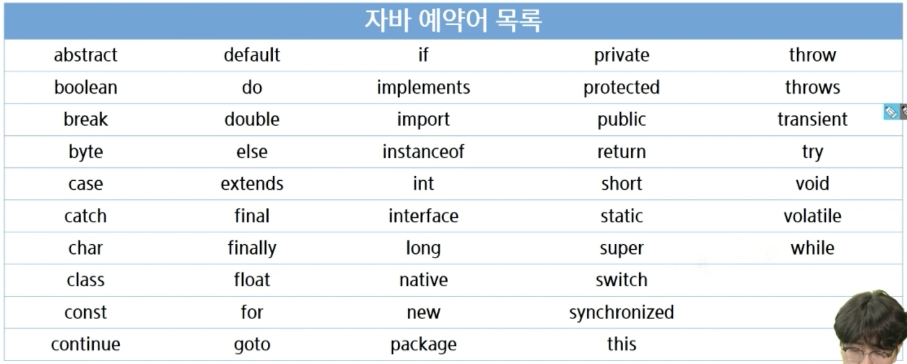
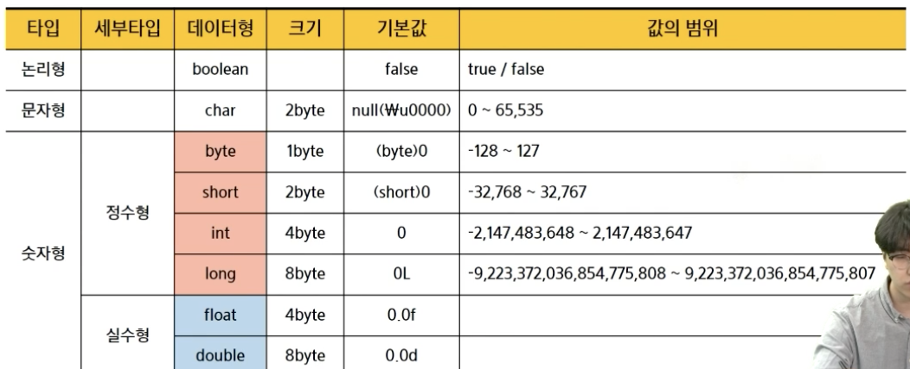
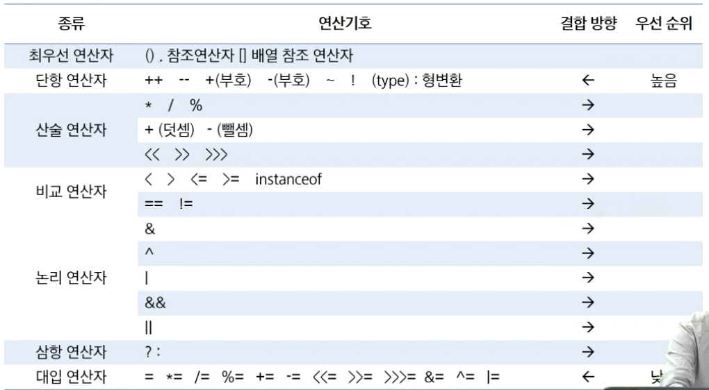
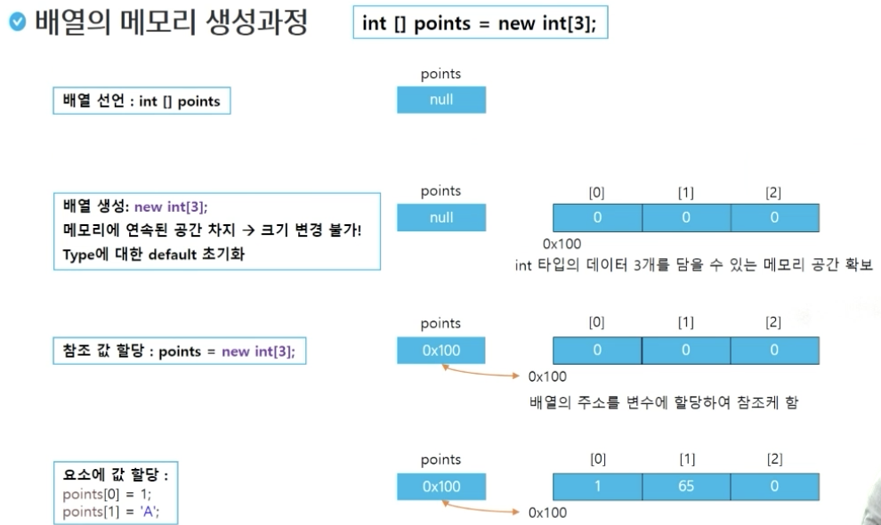

# Java


```java
public class Hello {
	public static void main(String[] args) {
		System.out.println("Hello SSAFY!!");
	}
}
```

IDE (통합 개발 환경) - eclipse

**intro**

- print, printf : 줄바꿈 안함
- println : 줄바꿈 함

```java
public class intro03_printTest {
	public static void main(String[] args) {
		System.out.print("Hello world");
		System.out.println("Hello world");
		System.out.printf("%d \n", 10);
		System.out.printf("%o \n", 10);
		System.out.printf("%x \n", 10);
		
		System.out.printf("%4d \n", 10); // 4칸 확보한 뒤 오른쪽부터 차지 
		System.out.printf("%-4d \n", 10); // 4칸 확보한 뒤 왼쪽부터 차지 
		System.out.printf("%04d \n", 10); // 4칸 확보한 뒤 오른쪽부터 차지 (빈칸 0으로 채움)
		
		System.out.printf("%f \n", 10.1); // 실수 
		System.out.printf("%.2f \n", 10.1); // 실수 (소수 둘째자리까지) 
		
		System.out.printf("%s \n", "yj"); 
		System.out.printf("%c \n", 'i');  
	}
}
```

### 변수와 자료형

- 변수
    - 대소문자 구분
    - 공백 허용 안함
    - 숫자로 시작 x
    - $, _ 변수 이름에 사용 가능
    - 예약어 사용 x
    - 함성어의 경우 camelCase 활용
    - 한글 변수 가능
        
        
        
- 자료형
    - 기본자료형(8가지): 미리 정해진 크기의 memory size 표현, 변수 자체에 값 저장
    - 참조자료형: 기본 자료형 외  모두 ex. String
    
    
    

| 선언 | 자료형 변수명; | int age; | String name; |
| --- | --- | --- | --- |
| 저장 | 변수명 = 저장할 값; | age = 30; | name = “철수” |
| 초기화 | 자료형 변수명 = 저장할 값; | int age = 30; |  |
- int는 기본자료형이기 때문에 바로 값을 저장
- String은 기본자료형이 아니기 때문에 주소를 저장하고 그 주소에 값을 저장


- 형변환
    
     자료형: 물품 보관소 / 데이어 : 물품
    
    - 묵시적(암묵적) 형변환: 자동 형변환, 범위가 넓은 데이터형에 좁은 데이터형 대입( 작은 범위에서 넓은 범위로)
        - byte b = (byte)100; int i = b;
    - 명시적 형변환 : 큰 범위에서 작은 범위로 옮기려고 할때 문제 생김
        - int i = 100; byte b = i; (x)
        - byte b = (byte) i; (o)

### 연산자 종류



- 삼항 연산자
    - 조건식? 식1 : 식2
    - 참이면 식1 / 거짓이면 식2

### 제어문

**조건문**

- if 문
    
    ```java
    if(age < 10){
    	System.out.println("10세 미만");
    }
    else if(age < 20){
    	System.out.println("20세 미만");
    }
    else{
    	System.out.println("맥주를 마실 수 있습니다.");
    }
    ```
    
- switch 문
    
    ```java
    switch(){
    	case age < 10:
    		System.out.println("10세 미만");
    		break;  //break 없이도 사용 가능 다만 밀에도 실행됨
    	case age < 20:
    		System.out.println("20세 미만");
    		break;
    	default:
    		System.out.println("맥주를 마실 수 있습니다.");
    ```
    

**반복문**

- for 문
    
    ```java
    for(int i = 0, j = 0; i < 10; i++, j+=2){
    	System.out.println(i);
    	System.out.println(j);
    }
    
    int i = 0: // for문 i랑 다름. for문 밑에 쓰면 for문꺼는 쓰고 땡
    ```
    
- while 문
    
    ```java
    int n = 5;
    while (n < 5){
    	System.out.println("실행안됨");
    }
    while (n >= 5){
    	System.out.println("한번 실행됨");
    	n--;
    }
    ```
    
- do-while 문
    
    ```java
    do {
    	System.out.println("실행됨");
    	n++;
    } while (n < 10);
    ```
    
- break : 반복문 블록 빠져나옴
- continue : 특정지점에서 반복문 처음으로 다시 돌아감

### 배열

- 같은 종류의 데이터를 저장하기 위한 자료구조
- 크기 고정
- 배열을 객체로 취급
- .length
- 배열 메모리 생성
    - int [] points = new int[3];
    
    
    
    ```java
    int[] score1;  // 되도록 이런 형식 쓰기
    int score2[];
    
    score1 = {1, 2, 3, 4, 5}; // 이렇게 못씀
    score1 = new int[] {1, 2, 3, 4, 5};  // 가능
    int[] score 2 = {1, 2, 3, 4, 5};  // 가능
    
    int[] score4 = new int[5];  // new 쓰면 0으로 초기화 돼있음 
    score4[0] = 10;
    score4[1] = 20;
    score4[2] = 30;
    score4[3] = 40;
    
    for(int i = 0; i < score4.length; i++){
    	System.out.println(score4[i]);
    }  // {10, 20, 30, 40, 0}
    ```
    
- for-each 문
    - 가독성이 개선된 반복문
    - 배열 및 Collections에서 사용
    - index 대신 접근하는 변수 제공
    - 읽기만 가능, 값 변경 불가
    
    ```java
    int[] intArray = {1, 3, 5, 7, 9};
    
    for (int x: intArray){
    	System.out.println(x);
    }
    
    for (int i=0; i<intArray.lenght; i++){
    	int x = intArray[i];
    	System.out.println(x);
    }
    ```