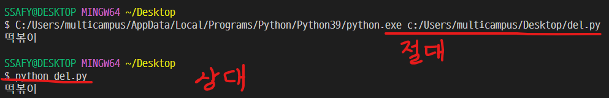
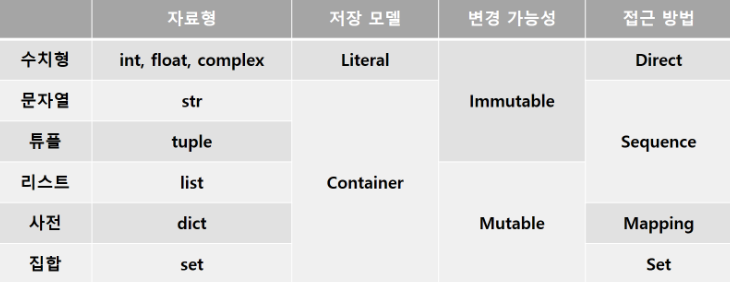
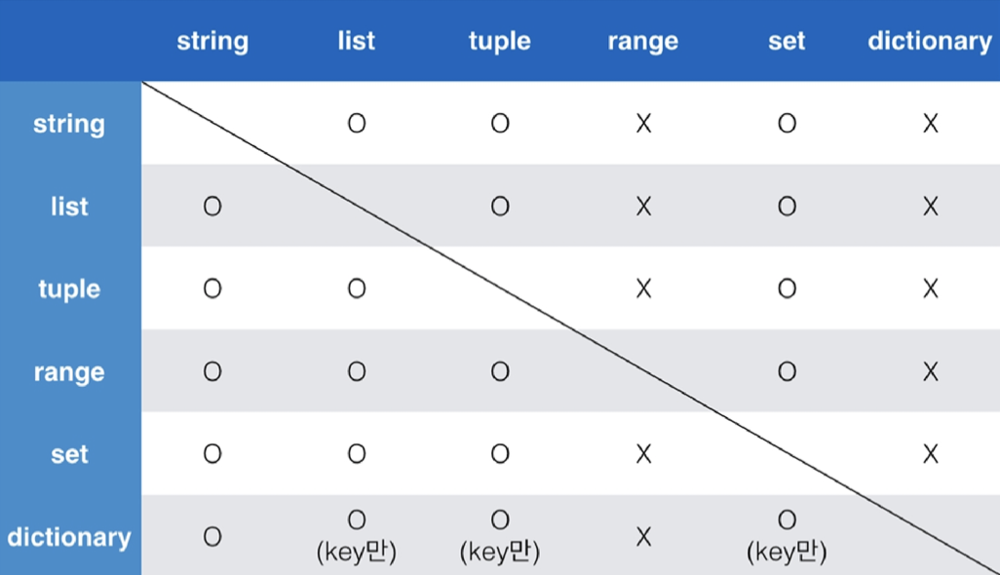
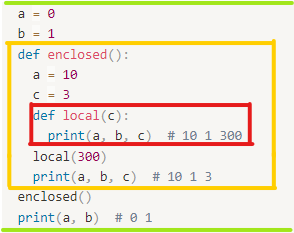
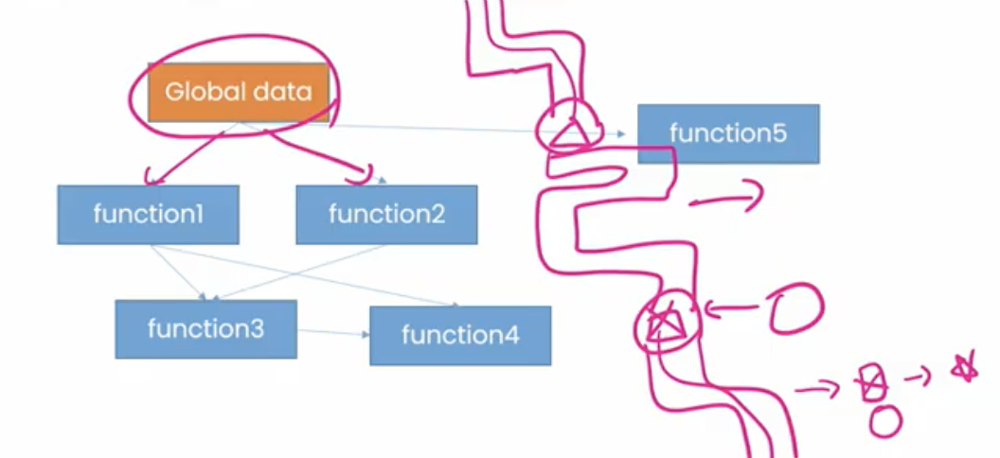

# Python

# 데이터 저장

---

- 주소
    
    
    
    API: 기능 ex) url끝에 원하는 값 알려줘
    

## 프로그래밍

- 프로그램을 만드는 행위
- 특정 작업을 수행하는 일련의 명령어들의 모임
- 컴퓨터는 2진법(기계어)만 인식 가능
- 프로그래밍 언어 → 인터프리터 → 기계어

## 파이썬을 사용하는 이유

- 쉬움
- 인터프리터 언어
- 객체 지향 프로그래밍

## IDE (Integrated development environment)

- 통합 개발 환경
- ex. Visual Studio code, Pycharm, Jupyter Notebook

## 스타일 가이드

- 한줄에 79자까지
- ‘문자열’(o)  “문자열”(x)
- space 4번 > tab ; 혼용 금지
- #한줄 주석, ‘’’여러줄 주석’’’(””” 사용 가능)

## 변수

- 데이터를 받는 상자
- 코드의 가독성 증가
- 수정 용이
- 값 여러개를 동시 할당 가능

### 변수 값 바꿔서 저장

```python
x, y = 10, 20
tmp = x
x = y
y = tmp
print(x, y) # 20, 10
```

```python
x, y = 10, 20
y, x = x, y
print(x, y) # 20 10
```

### 식별자

- 영어, _ , 숫자 구성
- 첫글자 숫자 x
- 길이 제한 x, 대소문자 구별
- import keyword의 keywords는 사용 불가
- 내장 함수, 모듈 이름 x

### 연산자

- +, -, *, /, //, **

```jsx
divmod(5, 2) # (2, 1) 5/2의 몫, 나머지
```

### 자료형

- 수치형 - int, float, 진수, 부동 소수점(해결: import math)
- 문자열 - str, ‘, ‘’, \n, \t, \r(캐리지 리턴), \0(Null), \\(\), \’, \”(인용부호)

```python
print("문자열 안에 '작은따옴포'를 사용하려면 큰따옴표로 묶음")
print('문자열 안에 "큰따옴포"를 사용하려면 작은따옴표로 묶음')
print('''문자열 안에 '작은따옴표'나 "큰따옴표"를 사용할 수 있고
여러줄을 사용할 때도 편리''')
```

```python
name = 'Kim'
score = 4.5

# %-formatting
print('Hello, %s' %name) # Hello, Kim
print('성적은 %d' %score) # 성적은 4
print('성적은 %f' %score) # 성적은 4.500000

# str.format()
print('Hello, {}! 성적은 {}'.format(name, score)) # Hello,Kim! 성적은 4.5

# f-strings
print(f'Hello, {name}! 성적은 {score}') # Hello,Kim! 성적은 4.5

import datetime
today = datetime.datetime.now()
print(today) # 2022-07-18 11:30:15.200411
print(f'오늘은 {today:%y}년 {today:%m}월 {today:%d}일') #오늘은 22년 07월 18일

pi = 3.141592
print(f'원주율은 {pi:.3}, 반지름이 2인 원 넓이는 {pi*2*2}')
# 원주율은 3.14, 반지름이 2인 원 넓이는 12.566368
```

- None - 값이 없음을 표현, 반환 값이 없는 함수에서 사용
- 불린형 - True, False/ 비교, 논리 연산에서 사용
    - 비교 연산자: <, >, < =, < =, ==, ! =, is, is not
    - 논리 연산자: and, nor, Not
        - Falsy: False는 아니지만 False로 취급되는 값 - 0, 0.0, (), [], {}, None, “”
        - 단축평가: and 연산 첫 값 False → False/ or 연산 첫 값 True → True
            - 단축평가가 되게 된 값을 반환함
        
        ```python
        print(3 and 5) # 5
        print(0 and 3) # 0
        print(3 or 5) # 3
        print(0 or 5) # 5
        ```
        

## 컨테이너

- 여러 개의 값(데이터)을 담을 수 있는 것(객체)
- 서로 다른 자료형을 저장할 수 있음
- Ordered/ Unordered
- 순서가 있다 ≠ 정렬되어 있다
- list>dict>range>tuple>set



➕ range: immutable

### 시퀀스형(ordered)

- 리스트
    - [], list()
    - 리스트 안에 리스트 가능
    - 가변 자료형: 값 변경 가능
- 튜플
    - (), tuple()
    - my_tuple[i] ; 인덱스로 접근 가능
    - 불변 자료형: 값 변경 불가
    - 단일 항목 - 생성 시 값 뒤에 ,(쉼표) 붙여야 함
    - 복수 항목 - 마지막 항목에 쉼표 없어도 되지만, **넣자**
- 레인지(Range)
    - 숫자의 시퀀스를 나타내기 위해 사용
    - 주로 반복문과 함께 사용
    - 불변 자료형
    
    ```python
    print(list(range(3))) # [0, 1, 2]
    print(list(range(1, 5))) # [1, 2, 3, 4]
    # range(start 시작인덱스, end 끝인덱스, step 간격)
    print(list(range(1, 5, 2))) # [1, 3]
    print(list(range(6, 1, -1))) # [6, 5, 4, 3, 2]
    print(list(range(6, 1, -2))) # [6, 4, 2]
    print(list(range(6, 1, 1))) # []
    ```
    
    - 슬라이스 연산자: 문자열의 특정부분 자름 [start 인덱스 : end 인덱스]
    
    ```python
    print([1, 2, 3, 5][1:4]) # [2,3,5]
    print((1, 2, 3)[:2]) # (1, 2)
    print(range(10)[5:7]) # range(5, 7)
    print('abcd'[2:4]) # cd
    print([1, 2, 3, 5][0:4:2]) # [1, 3]
    print(range(10)[1:5:3]) # range(1, 5, 3)
    print('abcdefg'[1:3:2]) # b
    print('abcd'[::-1]) # dcba 거꾸로 출력
    ```
    

### 비시퀀스형(unordered)

- 셋(set)
    - {}, set()
    - 중복되는 요소 없는 데이터들의 묶음
    - 순서 없으므로 인덱스로 접근 불가능
    - 집합
    - 가변 자료형
    
    ```python
    print({1, 2, 3, 1, 2}) # {1, 2, 3}
    
    blank = {} # 빈 중괄호는 Dictionary
    print(type(blank)) # <class 'dict'>
    blank_set = set()
    print(type(blank_set)) # <class 'set'>
    ```
    
    - set 연산자 - |(합집합), &(교집합), -(차집합), ^(대칭차집합), 여집합 없음
    
    ```python
    a_set = {1, 2, 3, 4}
    b_set = {1, 2, 3, 'hello', (1, 2, 3)}
    print(a_set | b_set) # {1, 2, 3, 4, (1, 2, 3), 'hello')
    print(a_set & b_set) # {1, 2, 3}
    print(b_set - a_set) # {(1, 2, 3), 'hello'}
    print(a_set ^ b_set) # {'hello', 4, (1, 2, 3)} 합집합-교집합
    ```
    
- 딕셔너리
    - {}, dict()
    - 키-값(key-value): key를 통해 value에 접근
    - 3.7ver. 부터 ordered
    - key: 변경 불가능한 데이터만 활용 가능(str, int, float, bool, tuple, range)
    - values: 어떤 형태는 상관 없음
    
    ```python
    dict_a = {}
    dict_b = dict()
    
    dict_a = {'a': 'apple', 'b': 'banana', 'list': [1, 2, 3]}
    print(dict_a) # {'a': 'apple', 'b': 'banana', 'list': [1, 2, 3]}
    print(dict_a['list']) # [1, 2, 3]
    
    dict_b = dict(a = 'apple', b = 'banana', list = [1, 2, 3])
    print(dict_b) # {'a': 'apple', 'b': 'banana', 'list': [1, 2, 3]}
    
    dict_a.keys() # key값만 가져옴
    dict_a.values() # value값만 가져옴
    ```
    

### 형변환

- 숫자 ↔ 문자
- 암시적 형 변환(자동; 파이썬이 하면)
    - bool
    - Numeric type (int, float)
    
    ```python
    print(True + 3) # 4 True=1
    print(3 + 5.0) # 8.0
    ```
    
- 명시적 형 변환(의도적; 개발자가 하면)
    - int
        - str, float ⇒ int (단, 형식에 맞는 문자열만 정수로 변환 가능)
        
        ```python
        print(int('3') + 4) # 7
        print('3' + str(4)) # 34
        ```
        
    - float
        - str, int ⇒ float
        
        ```python
        print(float('3')) # 3.0
        # float 형식이 아닌 경우 타입 변환 불가
        print(float('3/4') + 5.3) # ValueError: could not convert string to float: '3/4'
        ```
        
    - str
        - int, float, list, tuple, dict ⇒ str
        
        ```python
        print(str(1)) # 1
        print(str(1.0)) # 1.0
        print(str([1, 2, 3])) # [1, 2, 3]
        print(str((1, 2, 3))) # (1, 2, 3)
        print(str({1, 2, 3})) # {1, 2, 3}
        ```
        
    
    
    
# 데이터 처리

---

- 제어문
    - 조건문, 반복문
    - 순서도로 표현 가능
    - 기본적으로 위 → 아래로 명령 수행
    - 상황에 따라 선택적으로 실행(분기/조건/반복)하는 제어 필요

## 조건문

- 참/거짓을 판단할 수 있는 조건식 필요

```python
if num % 2: # if num % 2 == 1:
	print('홀수')
else:
	print('짝수')
```

### 복수 조건문

- elif 사용

### 중첩 조건문

- 조건문 안에 조건문 사용 가능
- 들여쓰기 유의

### 조건 표현식

- 조건에 따라 값을 정할 때 활용
- 삼항 연산자

```python
true인 경우 값 if 조건 else false인 경우 값

# 절댓값 저장
value = num if num >= 0 else -num
```

## 반복문

- 특정 조건을 만족할 때까지 같은 동작을 반복하고 싶을 때 사용
- while문: 종료 조건을 알 때
- for문: 반복할 범위를 알 때
- 반복 제어: break, continue, for-else

### while 문

- 조건식이 참인 경우 반복적으로 코드 실행
- 복합 연산자: 연산과 할당을 합쳐놓은 것 ex. 반목문 안에서 카운트하는 경우

```python
while 조건:
	# code block

# 복합 연산자
a = 0
while a < 5:
	print(a)
	a += 1
print('end')
```

### for 문

- 시퀀스(string, tuple, list, range)를 포함한 순회 가능한 객체의 요소를 모두 순회
    - 순회 가능한 자료형: string, list, dict, tuple, range, set
    - 순회형 함수: range, enumerate
- 처음 → 끝까지 모두 순회하므로 종료 조건 필요 없음

```python
for 변수명 in iterable:
	# code block
```

- dictionary 순회: 기본적으로 key를 순회함
    - .keys(), .values(), .items() 활용 가능

```python
# dictionary 순회

grades = {'john': 80, 'eric': 90}

for i in grades:
	print(i)  # john  eric
	print(i, grades[i])  # john 80  eric 90

for student, grade in grades.items():
	print(student, grade)  # john 80  eric 90
```

- enumerate 순회: 인덱스와 객체를 쌍으로 담은 열거형(enumerate) 객체 반환
    - (index, value) 형태의 tuple로 구성된 열거 객체를 반환

```python
[s# enumerate 순회

members = ['a', 'b', 'c']

for idx, member in enumerate(members):
	print(idx, member)  # 0 a  1 b  2 c

print(list(enumerate(members)))  # [(0, a), (1, b), (2, c)]
print(list(enumerate(members, start = 1)))  # [(1, a), (2, b), (3, c)]
```

- list comprehension: 표현식과 제어문을 통해 리스트를 간결하게 생성
- dictionary comprehension: 표현식과 제어문을 통해 딕셔너리를 간결하게 생성

```python
# list comprehension

[code for 변수 in iterable]
[code for 변수 in iterable if 조건식]

# 1~3의 세제곱 리스트 출력
cubic_list = [number ** 3 for number in range(1, 4)]
print(cubit_list)  # [1, 8, 27]

# dictionary comprehension

{key: value for 변수 in iterable}
{key: value for 변수 in iterable if 조건식}

# 1~3의 세제곱 딕셔너리 출력
cubic_list = {number: number ** 3 for number in range(1, 4)}
print(cubit_list)  # {1: 1, 2: 8, 3: 27}
```

### 반복문 제어

- break: 반복문 종료

```python
for i in range(10):
	if  i > 1:
		print('0과 1만 필요해!')
		break
	print(i)

'''
0
1
0과 1만 필요해!
'''
```

- continue: continue 이후 코드 수행 안하고, 다음 반복 수행

```python
for i in range(6):
	if i % 2 == 0:
		continue
	print(i)
'''
1
3
5
'''
```

- pass: 아무것도 하지 않음, 이후 코드 수행 (그냥 지나쳐줘)

```python
# pass VS continue

# i가 2일때 pass
for i in range(4):
	if i == 2:
		pass
	print(i)  # 0  1  2  3

# i가 2일때 continue
for i in range(4):
	if i == 2:
		continue
	print(i)  # 0  1  3
```

- for-else: 반복문 끝까지 실행 후 else문 실행
    - break를 통해 중간에 종료되면 else문 실행 안함

```python
for char in 'apple':
	if char == 'b':
		print('b!')
		break
else:
	print('b가 없습니다.')  # b가 없습니다.

for char in 'banana':
	if char == 'b':
		print('b!')  # b!
		break        # break 작동 - else문 실행X
else:
	print('b가 없습니다.')
```

## 함수

### 함수

- 특성한 기능을 하는 코드의 묶음
- decomposition(분해): 기능 단위로 쪼개고 재사용 가능하게
    - ex. len, sum
- abstraction(추상화): 재사용성, 가독성, 생산성, 내용(내부구조)을 몰라도 사용 가능하게
    - ex. 스마트폰, print
- 내장 함수: 파이썬에 기본으로 포함된 함수
외장 함수: import문을 통해 사용, 외부 라이브러리
사용자 정의 함수
- 선언과 호출(define&call) → 입력(Input) → 문서화(Docstring) → 범위(Scope) → 결괏값(Output)
    1. 선언고 호출
    2. 입력
    3. 문서화
    4. 범위
    5. 결과

### 함수의 결과값 (output)

- print VS return
    - print: 값을 출력
    - return: 값을 반환
        - 데이터 처리를 하기위해서는 return 해야함
        - return은 항상 **하나만 반환**
        - return 없으면 → None 반환
        
        ```python
        # XXXX안됨XXXX
        def calculator(x, y):
        	return x - y
        	return x + y
        
        # OOOO가능OOOO
        def calculator(x, y):
        	**return x - y, x + y  # 튜플로 2개 이상 값 반환**
        ```
        

### 함수의 입력 (input)

- parameter (매개변수, 인수): 함수를 정의할 때, 함수 내부에서 사용되는 변수
- argument (인자): 함수를 호출할 때, 넣어주는 값
    
    ```python
    def function(ham):  # parameter: ham
    	return ham
    
    function('spam')  # argument: 'spam'
    ```
    
- Positional Arguments: 자기 자리에 맞게 찾아 들어가는 것
- Keyword Arguments: 직접 변수 지정
    - keyword 와 positional 을 같이 적을 때는 무조건 positional이 먼저
    
    ```python
    def add(x, y):
    	return x + y
    
    add(x = 2, y = 5)
    add(2, y = 5)
    **add(x = 2, 5)  # Error 발생!**
    ```
    
- Default Arguments Values: 기본값을 지정해 함수 호출 시 argument 값을 먼저 처리
    
    ⇒ 복잡한 값은 나중에 넣어주자!
    
    ```python
    def add(x, y = 0):  # y=0 기본값 설정
    	return x + y
    
    add(2) # 2  x=2, y=0
    ```
    
- 가변 인자(*args) : 여러개의 Positional Argument를 하나의 필수 parameter로 받아서 사용
    - 몇 개의  Positional Argument를 받을지 모르는 함수를 정의할 때 유용
    - 언패킹 시 왼쪽 변수에 asterisk(*)를 붙이면, 할당하고 남은 요소를 리스트에 담음
    
    ```python
    def sum_all(*nums):
    	result = 0
    	for num in nums:
    		result += num
    	return result
    
    print(sum_all(1, 2, 3))  # 6
    
    # 언패킹 시 왼쪽 변수에 asterisk(*)를 붙이면, 할당하고 남은 요소를 리스트에 담음
    def family(father, mother, ***pets**):
    	print(father)  # 아빠
    	print(mother)  # 엄마
    	for name in pets:
    		print(name)  # 멍멍 \n 냥냥
    
    family('아빠', '엄마', **'멍멍', '냥냥'**)
    ```
    
- 가변 키워드 인자(**kwargs): 딕셔너리로 묶여 처리되며, parameter에 **를 붙여 사용
    - 몇 개의 Keyword Arguments를 받을지 모르는 함수를 정의할 때 유용
    
    ```python
    def family(father, mother, ****pets**):
    	print(father)  # 아빠
    	print(mother)  # 엄마
    	for species, name in pets.items():
    		print(f'{species}: {name}')  # dog: 멍멍 \n cat: 냥냥
    
    family('아빠', '엄마', **dog = '멍멍', cat = '냥냥'**)
    ```
    
- 가변 인자(*args)와 가변 키워드 인자(**kwargs) 동시 사용
    
    ```python
    def family(*parents, ****pets**):
    	for parent in parents:
    		print(parent)  # 아빠 /n 엄마
    	for species, name in pets.items():
    		print(f'{species}: {name}')  # dog: 멍멍 \n cat: 냥냥
    
    family('아빠', '엄마', **dog = '멍멍', cat = '냥냥'**)
    ```
    

### Python의 범위 (scope) - LEGB

- **함수 내에서는 바깥 scope의 변수에 접근 가능하나 수정 불가**


- **L**ocal (지역 범위) : 현재 작업 중
- **E**nclosed (지역 한 단계 위)
- **G**lobal (최상단)
- **B**uilt-in (모든 것을 담고 있는 범위) : 정의하지 않고 사용하는 모든 것 ex. print()

```python
a = 0
b = 1
def enclosed():
	a = 10
	c = 3
	def local(c):
		print(a, b, c)  # 10 1 300
	local(300)
	print(a, b, c)  # 10 1 3
enclosed()
print(a, b)  # 0 1
```



### 함수 응용

- map(function, iterable)
    
    ```python
    numbers = [1, 2, 3]
    result = map(str, numbers)
    print(result, type(result)) # <map object at 0x0000----> <class 'map'>
    print(list(result))  # ['1', '2', '3']
    ```
    
- filter(function, iterable) : 결과가 True인 것들을 filter object 반환
    
    ```python
    def odd(n):
    	return n % 2
    numbers = [1, 2, 3]
    result = filter(odd, numbers)
    print(result, type(result))  # <filter object at 0x0000----> <class 'filter'>
    print(list(result))  # [1, 3]
    ```
    
- zip(*iterables) : 복수의 iterable을 모아 튜플을 원소로 하는 zip object 반환
    
    ```python
    girls = ['jane', 'ashley']
    boys = ['justin', 'eric']
    pair = zip(girls, boys)
    print(pair, type(pari))  # <zip object at 0x0000----> <class 'zip'>
    print(list(pair))  # [('jane', 'justin'), ('ashley', 'eric')]
    ```
    
- lambda[parameter] : 표현식
    - 표현식을 계산한 결과값을 반환
    - return문 없음
    - 간편 조건문 외 조건문, 반복문 가질 수 없음
    - 함수를 정의하지 않고 간결하게 사용 가능
    - def를 사용할 수 없는 곳에서도 사용 가능
    
    ```python
    # def 사용
    def triangle_area(b, h):
    	return 0.5 * b * h
    print(triangle_area(5, 6))  # 15.0
    
    # lambda 사용
    triangle_area = lambda b, h : 0.5 * b * h
    print(triangle_area(5, 6))  # 15.0
    ```
    
- 재귀함수 : 자기 자신을 호출하는 함수 ex. factorial
    
    ```python
    def factorial(n):
    	if n == 0 or n == 1:
    		return 1
    	else:
    		return n * factorial(n-1)
    print(factorial(4))  # 24
    ```
    

## 모듈

- 모듈 = 하나의 파이썬 파일 단위 (파일 하나하나가 모듈)
- 다양한 기능을 하나의 파일로

### 모듈과 패키지

```python
import module  # module.var
import module as md  # md.var
from module import var, function  # 필요한 기능만 import
from module import *  # 사용할 때 module. 안붙여도 됨 var()
```

### Python 표준 라이브러리

```bash
pip freeze > requirments.txt
pip install -r requirments.txt  # -r을 넣어주면 순서대로 다운받아줌
```

### 사용자 모듈과 패키지

- 패키지는 여러 모듈/하위 패키지로 구조화 ex. package.module
- 모든 폴더에 __init__.py를 만들어 패키지로 인식

```python
# calculator/tools.py
def add()

def minus()

from calculator import tools

print(dir(tools))
print(tools.add(3, 5))  # 8
print(tools.minus(3, 5))  # -2
```

### 가상환경

- 파이썬 표준 라이브러리가 아닌 외부 패키지와 모듈을 사용하는 경우, 모두 pip를 통해 설치 해야함
- 복수의 프로젝트를 하는 경우 버전이 상이할 수 있음

⇒ 이런 경우 가상환경을 만들어 프로젝트별로 독립적인 패키지를 관리할 수 있음

```bash
python -m venv <폴더명>
deactivate  # 가상환경 비활성화
```

# 데이터 구조

---

### 데이터구조.메서드() = 주어.동사()

## 순서가 있는 데이터 구조

### 문자열(string)

- 변경 불가능(immutable)

| 문법 | 설명 |
| --- | --- |
| s.find(x) | x의 첫 번째 위치를 반환. 없으면, -1 반환 |
| s.index(x) | x의 첫 번째 위치를 반환. 없으면, 오류 발생 |
| s.isalpha() | 알파벳 문자 여부 (유니코드상 letter, 한국어 포함) |
| s.isupper() | 대문자 여부 |
| s.islower() | 소문자 여부 |
| s.istitle() | 타이틀 형식 여부 |

### 리스트(list)

- 가변 자료형

| 문법 | 설명 |
| --- | --- |
| L.append(x) | 리스트 마지막에 항목 x를 추가 |
| L.insert(i, x) | 리스트 인덱스 i에 항목 x를 삽입 |
| L.remove(x) | 리스트 가장 왼쪽에 있는 항목(첫 번째) x를 제거. 항목 없으면, ValueError |
| L.pop() | 리스트의 가장 오른쪽에 있는 항목(마지막)을 반환 후 제거 |
| L.pop(i) | 리스트의 인덱스 i에 있는 항목을 반환 후 제거 |
| L.extend(m) | 순회형 m의 모든 항목들의 리스트 끝에 추가 (+=과 같은 기능) |
| L.index(x, start, end) | 리스트에 있는 항목 중 가장 왼쪽에 있는 항목 x의 인덱스를 반환 |
| L.reverse() | 리스트를 거꾸로 정렬 |
| L.sort() | 리스트를 정렬(매개변수 이용가능) |
| L.count(x) | 리스트에서 항목 x가 몇 개 존재하는지 갯수를 반환 |

### 튜플(tuple)

- 불변 자료형

```python
a = (1, 2, 3, 1)
a[0] = 3 # 에러 발생

day_name = ('월', '화', '수', '목', '금')
#인덱스로 접근
print(day_name[-2]) # 목

# 반복결합 연산자
print(day_name * 2) # ('월', '화', '수', '목', '금', '월', '화', '수', '목', '금')

# 확장 연산자; += 사용/ extend는 값을 변경하기 때문에 지원 안함
day_name += '토', '일'
print(day_name) # ('월', '화', '수', '목', '금', '토', '일')
```

## 순서가 없는 데이터 구조

### 셋(set)

- 중복 없음
- 순서 없음
- 가변 자료형

| 문법 | 설명 |
| --- | --- |
| s.copy() | 셋은 얕은 복사본을 반환 |
| s.add() | 항목 x가 셋 s에 없다면 추가 |
| s.pop() | 셋 s에서 랜덤하게 항목을 반환하고, 해당 항목을 제거. set이 비어있을 경우, KeyError |
| s.remove(s) | 항목 x를 셋 s에서 삭제, 항목이 없으면, KeyError |
| s.discard(x) | 항목 x가 셋 s에 있는 경우, 항목 x를 셋 s에서 삭제 |
| s.update(t) | 셋 t에 있는 모든 항목 중 셋 s에 없는 항목을 추가 |
| s.clear() | 모든 항목을 제거 |
| s.isdisjoint(t) | 셋 s가 셋 t의 서로 같은 항목을 하나라도 갖고 있지 않은 경우, True 반환 |
| s.issubset(t) | 셋 s가 셋 t의 하위 셋인 경우, True반환 |
| s.issuperset(t) | 셋 s가 셋 t의 상위 셋인 경우, True반환 |

### 딕셔너리(dictionary)

- key-value쌍
- key: 불변 자료형
- value: 가변 자료형

| 문법 | 설명 |
| --- | --- |
| d.clear() | 모든 항목을 제거 |
| d.copy() | 딕셔너리 d의 얕은 보사본을 반환 |
| d.keys() | 딕셔너리 d의 모든 키를 담은 뷰를 반환 |
| d.values() | 딕셔너리 d의 모든 값을 담은 뷰를 반환 |
| d.items() | 딕셔너리 d의 모든 키-값의 쌍을 담은 뷰를 반환 |
| d.get(k) | 키 k의 값을 반환하는데, 키 k가 딕셔너리 d에 없을 경우 None을 반환 |
| d.get(k, v) | 키 k의 값을 반환하는데, 키 k가 딕셔너리 d에 없을 경우 v을 반환 |
| d.pop(k) | 키 k의 값을 반환하고 키 k인 항목을 딕셔너리 d에서 삭제하는데, 키 k가 딕셔너리 d에 없을 경우 KeyError |
| d.pop(k, v) | 키 k의 값을 반환하고 키 k인 항목을 딕셔너리 d에서 삭제하는데, 키 k가 딕셔너리 d에 없을 경우 v를 반환 |
| d.update([other]) | 딕셔너리 d의 값을 매핑하여 없데이트 |

## 얕은 복사 & 깊은 복사

- 할당
    - 대입연산자(=)
    
    ```python
    original_list = [1, 2, 3]
    copy_list = original_list
    print(original_list, copy_list)  # [1, 2, 3] [1, 2, 3]
    
    copy_list[0] = 'hello'
    print(original_list, copy_list)  # ['hello', 2, 3] ['hello', 2, 3]
    ```
    
- 얕은 복사: 주소가 같은 곳을 참조함 ⇒ 하나가 바뀌면 복사한것도 바뀜
    
    ```python
    a = [1, 2, 3]
    b = a
    print(a, b)  # [1, 2, 3] [1, 2, 3]
    b[0] = 5
    print(a, b)  # [5, 2, 3] [5, 2, 3]
    ```
    
    - **slice 연산자 활용**하여 같은 원소를 가진 리스트지만 연산된 결과를 복사 (**다른 주소**)
    
    ```python
    a = [1, 2, 3]
    b = a[:]
    print(a, b)  # [1, 2, 3] [1, 2, 3]
    b[0] = 5
    print(a, b)  # [1, 2, 3] [5, 2, 3]
    ```
    
    - 주의: 복사하는 리스트의 원소가 주소를 참조하는 경우
        
        → **값을 모아놓은 것을 복사하는 경우에는 깊은 복사를 해야함**
        
    
    ```python
    a = [1, 2, ['a', 'b']]
    b = a[:]
    print(a, b)  # [1, 2, ['a', 'b']] [1, 2, ['a', 'b']]
    b[2][0] = 0
    print(a, b)  # [1, 2, [0, 'b']] [1, 2, [0, 'b']]
    
    # a, b의 주소(id)값은 다르지만, 내부 값은 영향을 받음
    # 내부의 객체 id(a[2])과 id(b[2])은 같은 주소를 바라보고 있기 때문
    ```
    
- 깊은 복사: 주소가 다른 곳에 복사 ⇒ 서로 독립적
    - 값을 모아놓은 것을 복사하는 경우에는 깊은 복사를 해야함
    
    ```python
    **import copy**
    a = [1, 2, ['a', 'b']]
    b = **copy.deepcopy**(a)
    print(a, b)  # [1, 2, ['a', 'b']] [1, 2, ['a', 'b']]
    b[2][0] = 0
    print(a, b)  # [1, 2, ['a', 'b']] [1, 2, [0, 'b']]
    ```


# OOP (Object-Oriented Programming)

---

절차지향 → 객체지향

## 객체지향 프로그래밍

- 객체
    
    모든 것이 객체, 모든 객체는 특정 타입의 인스턴스
    
    모든 객체는 타입(type), 속성(attribute), 조작법(method)을 가집니다.
    
    - **타입(type)**: 어떤 연산자(operator)와 조작(method)이 가능한가?
    - **속성(attribute)**: 어떤 상태(데이터)를 가지는가?
    - **조작법(method)**: 어떤 행위(함수)를 할 수 있는가?

### 객체지향 프로그래밍

- 컴퓨터 프로그래밍의 패러다임(방법론) 중 하나이다.
- 프로그램을 여러 개의 독립된 객체들과 그 객체 간의 상호작용으로 파악하는 프로그래밍 방법
- 객체 = 변수 + 함수  ex. 가수: 아이돌 + 노래
- 코드의 **직관성**
- 활용의 **용이성**
- 변경의 **유연성**
- 절차지향
    
    Global data - function1 - function4, function2 - function3 - function4, function5…
    
    중간에 바뀌면 줄줄이 다 바꿔야함
    
    
    
- 객체지향
    
    데이터와 기능(메서드) 분리, 추상화된 구조(인터페이스)
    
    Object 안에 특정 기준에 맞춰서 
    
    Object1 - data - methods1(함수), methods2
    
    Object2 - data - methods
    
    ![OOP]](Python/oop.png)
    

### OOP 기초

- 객체 = 속성 + 행동/기능  = `**변수` + `함수-메서드`** = 특정 타입의 인스턴스다
    - 속성: 직업-가수, 국적-대한민국
    - 행동: 랩하기 , 댄스
- 가수 이찬혁
    - 클래스 - 가수 / 객체(실제 사례) - 이찬혁
- 인스턴스 : 클래스로 만든 객체
    - 이찬혁은 객체다 (o)
    - 이찬혁은 인스턴스다 (x)
    - 이찬혁은 가수의 인스턴스다 (o)
- 클래스(가수)를 만든다 = 타입(list)을 만든다

### 객체와 클래스 문법

```python
# 클래스 정의
class MyClass:
	pass

# 인스턴스 생성
my_instance = MyClass()

# 속성 접근
my_instance.my_attribute

# 메서드 호출
my_instance.my_method()
```

- 객체의 설계도(클래스)를 가지고 객체(인스턴스)를 생성한다.
    - Person (클래스) → 가수 이찬혁, 감독 강해피, 팬 김해피 (인스턴스)
- 클래스 : 객체들의 분류 / 설계도
- 인스턴스 : 하나하나의 실체 / 예

```python
class Person:
	pass
print(type(Person))  # <class 'type'>

person1 = Person()

print(isinstance(person1 Person))  # True
print(type(person1))  # <class '_ _main_ _.Person'>
```

- == VS is
    - == : 변수가 참조하는 객체가 내용이 같은 경우
    - is : 두 변수가 동일한 객체를 가리키는 경우
    
    ```python
    a = [1, 2, 3]
    b = [1, 2, 3]
    print(a == b, a is b)  # True False
    
    a = [1, 2, 3]
    b = a
    print(a == b, a is b)  # True True
    ```
    

### OOP 속성

- 특정 데이터 타입/클래스의 객체들이 가지게 될 상태/데이터를 의미
- 클래스 변수/ 인스턴스 변수가 존재
- 클래스 변수
    - 한 클래스의 모든 인스턴스가 공유하는 값을 의미
    - 같은 클래스의 인스턴스들은 같은 값을 갖게 됨
    - ex. 특정 사이트의 User 수 등은 클래스 변수를 사용해야 함
    - 클래스 선언 내부에서 정의
    - <classname>.<name>으로 접근 및 할당
- 인스턴스 변수
    - 인스턴스가 개인적으로 가지고 있는 속성, 각 인스턴스들의 고유한 변수
    - 생성자 메서드(`__init__`)에서 self.<name>으로 정의
    - 인스턴스가 생성된 이후 <instance>.<name>으로 접근 및 할당

```python
class Person:
	blood_color = 'red'  # 클래스 변수 정의
	population = 100  # 클래스 변수 정의
	count = 0  # 사용자가 몇명인지 확인

		def __init__(self, name):  # 인스턴스 변수 정의
			self.name = name  # 인스턴스 변수
			Person.count += 1  # 인스턴스가 생성될 때마다 클래스 변수가 늘어나도록 설정

person1 = Person('유진')
person2 = Person('정호')

print(person1.name)  # 유진  /인스턴스 변수 접근 및 할당
print(person1.blood_color)  # red  /클래스 변수 접근 및 할당

Person.blood_color = 'blue'  # 클래스 변수 변경
print(person1.blood_color)  # blue
print(person2.blood_color)  # blue

person1.population = 20  # 인스턴스 변수 변경
print(Person.population)  # 100  /클래스 변수
print(person2.population)  # 100  /클래스 변수
print(person1.population)  # 20  /새로운 인스턴스 변수가 생성됨

print(Person.count)  # 2  /사용자가 몇명인지 확인
```

### OOP 메서드

- 특정 데이터 타입/클래스의 객체에 공통적으로 적용 가능한 행위(함수)
- 클래스 - 인스턴스 변수 사용 불가
- 인스턴스 - 클래스 변수, 인스턴스 변수 둘 다 사용 가능

```python
class Person:

	def talk(self):
		print('안녕')

	def eat(self, food):
		print(f'{food}를 냠냠')

person1 = Person()
person1.talk()  # 안녕
person1.eat('피자') # 피자를 냠냠
person1.eat('치킨') # 치킨를 냠냠
```

- **인스턴스 메서드**
    - 인스턴스 변수를 사용하거나, 인스턴스 변수에 값을 설정하는 메서드
    - 클래스 내부에 정의되는 메서드의 기본
    - 호출 시, 첫번째 인자로 인스턴스 자기자신(self)이 전달됨
    
    ```python
    class MyClass:
    
    	def instance_method(self, arg1, ...):
    
    my_instance = MyClass()
    my_instance.instance_method(...)
    ```
    
    - 생성자 메서드 : 인스턴스 객체가 생성될 때 자동으로 호출되는 메서드
        - 인스턴스 변수들의 초기값을 설정
        - 인스턴스 생성, `__init__` 메서드 자동 호출
        
        ```python
        class Person:
        
        	def __init__(self):
        		print('인스턴스가 생성되었습니다.')
        
        person1 = Person()  # 인스턴스가 생성되었습니다.
        
        class Person:
        
        	def __init__(self, name):
        		print(f'인스턴스가 생성되었습니다. {name}')
        
        person1 = Person('지민')  # 인스턴스가 생성되었습니다. 지민
        ```
        
    - 소멸자 메서드 : 인스턴스 객체가 소멸(파괴)되기 직전에 호출되는 메서드
        
        ```python
        class Person:
        
        	def __del__(self):
        		print('인스턴스가 사라졌습니다.')
        
        person1 = Person()
        del person1  # 인스턴스가 사라졌습니다.
        ```
        
    - 매직 메서드(스페셜 메서드) : Double underscore(__)가 있는 메서드
        - 특수한 동작을 위해 만들어짐
        - 특정 상황에 자동으로 불림
        - `__str__(self)`, `__len(self)__`, `__repr__(self)`
        - `__lt__(self, other)`, `__le__(self, other)`, `__eq__(self, other)`
        - `__gt__(self, other)` , `__ge__(self, other)`, `__ne__(self, other)`
        - `__str__` : 해당 객체의 출력형태를 지정, print() 호출할 때 자동 호출
        - `__gt__` : 부등호 연산자(>, greater than)
        
        ```python
        class Circle:
        
        	def __init__(self, r):
        		self.r = r
        	
        	def area(self):
        		return 3.14 * self.r * self.r
        
        	def __str__(self):
        		return f'[원] radius: {self.r}'
        
        	def __gt__(self, other):
        		return self.r > other.r
        
        c1 = Circle(10)
        c2 = Circle(1)
        
        print(c1)  # [원] radius: 10
        print(c2)  # [원] radius: 1
        print(c1 > c2)  # True
        print(c1 < c2)  # False
        ```
        
- **클래스 메서드**
    - @classmethod 데코레이터를 사용하여 정의
    - 호출 시, 첫번째 인자로 클래스(cls)가 전달됨
    - 데코레이터 : 함수를 어떤 함수로 꾸며서 새로운 기능을 부여, 함수 위에 작성
    
    ```python
    class MyClass:
    	
    	@classmethod
    	def class_method(cls, arg1, ...):
    
    MyClass.class_method(...)
    ```
    
    ```python
    class Person:
    	count = 0
    	def __init__(self, name):
    		self.name = name
    		Person.count += 1
    
    	@classmethod
    	def number_of_population(cls):
    		print(f'인구수는 {cls.count}입니다.')
    
    person1 = Person('아이유')
    person2 = Person('이찬혁')
    print(Person.count)
    ```
    
- **정적(스태틱) 메서드**
    - 인스턴스 변수, 클래스 변수를 전혀 다루지 않는 메서드
    ⇒ 객체 상태나 클래스 상태를 수정할 수 없음
    - 속성을 다루지 않고 단지 기능(행동)만을 하는 메서드를 정의할 때 사용
    - @staticmethod 데코레이터 사용하여 정의
    - 일반 함수처럼 동자가지만 클래스의 namespace에 귀속됨
    - 주로 해당 클래스로 한정하는 용도로 사용
    
    ```python
    class MyClass:
    
    	@staticmethod
    	def static_method(arg1, ...):
    
    MyClass.static_method(...)
    ```
    
    ```python
    class Person:
    	count = 0
    	def __init__(self, name):  # 인스턴스 변수 설정
    		self.name = name
    		Person.count += 1
    
    	@staticmethod
    	def check_rich(money):  # 스태틱은 cls, self 사용 x
    		return money > 10000
    
    person1 = Person('아이유')
    person2 = Person('이찬혁')
    print(Person.check_rich(100000)  # True 스태틱은 클래스로 접근 가능
    print(person1.check_rich(100000)  # True 스택틱은 인스턴스로 접근 가능
    ```
    
- 인스턴스와 클래스 간의 이름 공간 (namespace)
    - 클래스를 정의하면, 클래스와 해당하는 이름 공간 생성
    - 인스턴스를 만들면, 인스턴스 객체가 생성되고 이름공간 생성
    - 인스턴스에서 특정 속성에 접근하면, 인스턴스-클래스 순으로 탐색
    
    ```python
    # Person 정의
    class Person:
    	name = 'unknown'
    
    	def talk(self):
    		print(self.name)
    
    p1 = Person()
    p1.talk()  # unknown /p1은 인스턴스 변수가 정의되지 않아 클래스 변수 출력
    
    # p2 인스턴스 변수 설정 전/후
    p2 = Person()
    p2.talk()  #unknown
    p2.name = 'Kim'
    p2.talk()  # Kim  /p2는 인스턴스 변수가 정의되어 인스턴스 변수 출력
    
    print(Person.name) # unknown
    print(p1.name) # unknown
    print(p2.name) # Kim
    
    ''' Person 클래스의 값이 Kim으로 변경된 것이 아닌 
    p2 인스턴스의 이름 공간에 name이 Kim으로 저장됨 '''
    ```
    

### 메서드 정리

- 인스턴스 메서드 : 호출한 인스턴스를 의미하는 self 매개 변수를 통해 인스턴스를 조작
- 클래스 메서드 : 클래스를 의미하는 cls 매개 변수를 통해 클래스를 조작
- 스태틱 메서드 : 클래스 변수나 인스턴스 변수를 사용하지 않는 경우에 사용
    - 객체 상태나 클래스 상태를 수정할 수 없음

```python
class MyClass:

	def method(self):
		return 'instance method', self

	@classmethod
	def classmethod(cls):
		return 'class method', cls

	@staticmethod
	def staticmethod():
		return 'static method'

# 인스턴스 메서드 호출
obj = MyClass()
print(obj.method())  # ('instance method', <__main__.MyClass at 0x-->)
print(MyClass.method(obj))  # ('instance method', <__main__.MyClass at 0x-->)

# 클래스 자체에서 메서드 호출 - 인스턴스 메서드는 호출 불가
print(MyClass.classmethod())  # ('class method', __main__.MyClass)
print(MyClass.staticmethod())  # static method
MyClass.method()  # method() missing 1 required positional argument: 'self'

# 인스턴스는 클래스 메서드와 스태틱 메서드 모두 접근 가능
print(obj.classmethod())  # ('class method', <class '__main__.MyClass'>)
print(MyClass.classmethod())  # ('class method', <class '__main__.MyClass'>)
print(obj.staticmethod())  # static method
```

## 객체 지향의 핵심개념

### 추상화 : 복잡한거 숨기고, 필요한거 나타냄

현실 세계를 프로그램 설계에 반영

### 상속 : 부모 클래스 - 자식 클래스 관계 → 물려받기 → 재사용

- 두 클래스 사이 부모 - 자식 관계 정립
- 클래스는 상속이 가능함
- 모든 파이썬 클래스는 object를 상속 받음
- 하위 클래스는 상위 클래스에 정의된 속성, 행동, 관계, 제약 조건 모두 상속 받음
- 코드 재사용성 높음
- 메서드 오버라이딩을 통해 자식 클래스에서 재정의 가능
- 상속관계에서 namespace는 인스턴스, 자식 클래스, 부모 클래스 순으로 탐색
- 다중상속
    - 2개 이상의 클래스를 상속 받는 경우
    - 상속받은 모든 클래스의 요소를 활용 가능함
    - 중복된 속성이나 메서드가 있는 경우 상속 순서에 의해 결정

```python
class ChildClass(ParentClass):
```

| 함수/ 메서드 | 설명 |
| --- | --- |
| isinstance(object, classinfo) | classinfo의 instance거나 subclass인 경우 |
| issubclass(class, classinfo) | class가 classinfo의 subclass면 True/ classinfo는 클래스 객체의 튜플일 수 있으며, classinfo의 모든 항목을 검사 |
| super() | 자식 클래스에서 부모 클래스를 사용하고 싶은 경우 |
| mro() | 해당 인스턴스의 클래스가 어떤 부모 클래스를 가지는지 확인하는 메서드/ 기존 인스턴스 → 자식 클래스 → 부모 클래스 |

### 다형성 : 이름은 같은데, 동작은 다른 것 → 오버라이딩 → 부모자식이 그대로(x) 자식이 변경

- 여러 모양
- 동일한 메서드가 클래스에 따라 다르게 행동할 수 있음
- 즉, 서로 다른 클래스에 속해있는 객체들이 동일한 메시지에 대해 다른 방식으로 응답 가능
- 메서드 오버라이딩
    - 상속받은 메서드를 재정의
    - 상속받은 클래스에서 같은 이름의 메서드로 덮어씀
    - 부모 클래스의 메서드를 실행시키고 싶은 경우 super를 활용

### 캡슐화 : 민감한 정보를 숨기는 것 → getter, setter

- 객체의 일부 구현 내용에 대해 외부로부터의 직접적인 엑세스를 차단 ex. 주민등록번호
- 파이썬에서 암묵적으로 존재하지만, 언어적으로는 존재하지 않음
- Public Member
    - 언더바 없이 시작하는 메서드나 속성
    - 어디서나 호출이 가능, 하위 클래스 override 허용
    - 일반적으로 작성되는 메서드와 속성의 대다수를 차치
- Protected Member :
- Private Member
- getter()
- setter()


# 에러/예외처리

---

## 에러와 예외

## 예외처리