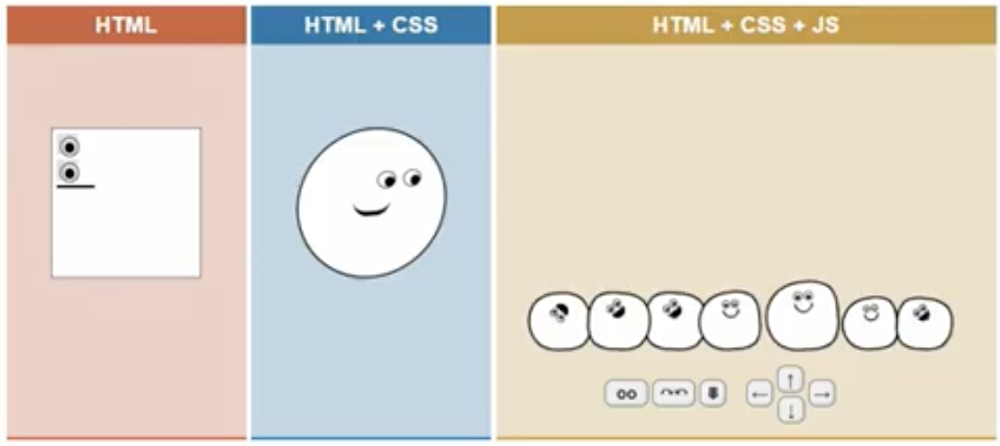
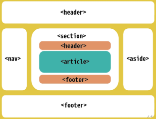
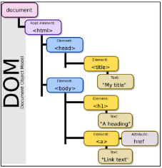
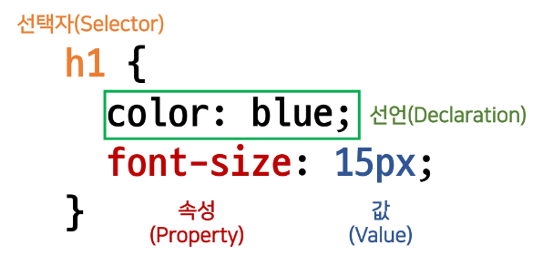
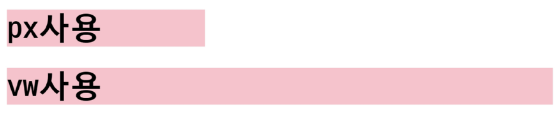
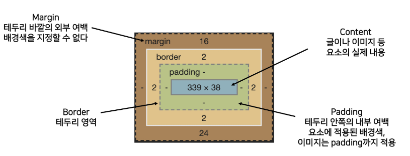
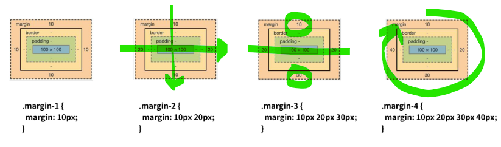
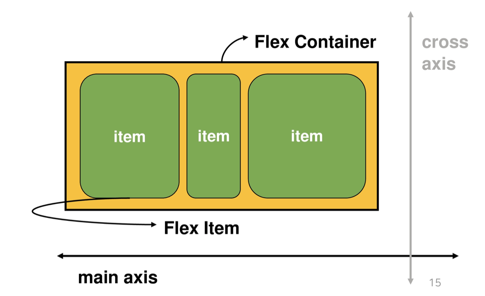

# Web


- 참고자료
    
    [이번에야말로 CSS Flex를 익혀보자](https://studiomeal.com/archives/197)
    
- 개발자 도구 Emmet
    
    [Cheat Sheet](https://docs.emmet.io/cheat-sheet/)
    
    [https://docs.emmet.io/cheat-sheet/](https://docs.emmet.io/cheat-sheet/)
    

## Web

- 브라우저를 통해서 접속하는 웹 페이지(문서)들의 모음
- 링크를 통해 여러 웹 페이지를 연결한 것

<aside>
💡 HTML → 구조
CSS → 표현
Javascript → 동작



</aside>

- 파편화 : 브라우저마다 동작이 약간씩 달라서 문제가 생김 → 웹 표준 등장
- 웹 표준 : 웹에서 표준적으로 사용되는 기술/규칙
- 크로스 브라우징 : 어떤 브라우저는 웹 페이지가 동일하게 보이도록 함

## HTML(Hyper Text Markup Language)

- **웹 페이지를 작성/구조화하기 위한 언어**
- Hyper Text : 참조(하이퍼링크)를 통해 사용자가 한 문서에서 다른 문서로 즉시 접근할 수 있는 텍스트
- Markup Language : 태그 등을 이용해 문서나 데이터의 구조를 명시하는 언어 ex. HTML, Markdown
- 스타일 가이드 : 2 space

### HTML 기본 구조 (!+tab)

```html
<!DOCTYPE html>
<html land="en">  <!-- 최상위(root)요소 -->
  <head>  <!-- 메타데이터 요소 -->
		<meta charset="UTF-8">  <!-- 문서 레벨 메타데이터 요소 -->
    <title>배고파</title>
		<link href="style.css" rel="stylesheet">
		<script src="javascript.js"></script>
		<style></style>  <!-- CSS 직접 작성 -->
  </head>
  <body>  <!-- 본문 요소 -->
		오늘 점심 뭐지
  </body>
</html>
```

- 메타데이터 : 데이터가 많을 때 접근성을 높여주기 위해 어떤 값을 보여줄 것인가 - 키워드 집합
    - 링크 보낼때 작게 보여주는 창에 들어갈 내용을 메타데이터에 저장
- 요소(element) = 태그 + 내용
    - 내용 없는 태그 존재 (닫는 태그 없음) : br, hr, img, input, link, meta
    - 요소는 중첩될 수 있음
- 속성(attribute) : <a 속성명=“속성값”></a> :
    - `=`사이에 공백 NO

| 기본 태그 | 내용 |
| --- | --- |
| id | 딱 한개 요소 지정하고 싶을 때 |
| class | 여러개 요소 지정하고 싶을 때 |
| data-* | 페이지에 대한 개인 사용자 정의 데이터 저장 |
| style | inline 스타일 |
| title | 요소에 대한 추가 정보 지정 |
| tabindex | 요소의 탭 순서 |
- 시맨틱 태그
    - HTML 태그가 **특정 목적, 역할 및 의미적 가치**(semantic value)를 가지는 것
    - non semantic 요소 : div, span
    - semantic 태그 : a, form, table 등
    - 의미 있는 정보의 그룹을 태그로 표현
    - 요소의 의미가 명확해지기 때문에 코드의 가독성을 높이고 유지보수를 쉽게 함
    - 검색 엔진 최적화(SEO)를 위해 시맨틱 태그, 메타 태그 사용
    - 렌더링이 빠르게 됨
    
    
    
    | 시맨틱 태그 | 설명 |
    | --- | --- |
    | header | 문서 전체나 섹션의 헤더 (말머리 부분) |
    | nav | 내비게이션 |
    | aside | 사이드에 위치한 공간, 메인 콘텐츠와 관련성이 적은 콘텐츠 |
    | section | 문서의 일반적인 구분, 컨텐츠의 그룹을 표현 |
    | article | 문서, 페이지, 사이트 안에서 독립적으로 구분되는 영역 |
    | footer | 문서 전체나 섹션의 푸터 (마지막 부분) |
- DOM(Document Object Model) 트리 ⭐
    - 텍스트 파일인 HTML 문서를 브라우저에서 렌더링 하기 위한 구조
    - HTML 문서 내의 각 요소에 접근 / 수정에 필요한 프로퍼티와 메서드를 제공
    - 나무를 거꾸로 한 함수 (재귀 함수)
    
    
    

### HTML 문서 구조화

- 인라인 요소 : 써있는 그 자리만 차지, 글자처럼 취급
- 블록 요소 : 어떤 자리(한줄 전체)를 차지하고 있는 요소

| 텍스트 요소 태그 | 설명 |
| --- | --- |
| <a></a> | href 속성을 활용하여 URL로 연결하는 하이퍼링크 생성 |
| <b></b> <strong></strong> | 굵은 글씨 강조 |
| <i></i> <em></em> | 기울임 글씨 강조 |
| <br> | 텍스트 내에 줄 바꿈 생성 |
|  | src 속성을 활용하여 이미지 표현 |
| <span></span> | 의미 없는 인라인 컨테이너 |

| 그룹 컨텐츠 태그 | 설명 |
| --- | --- |
| <p></p> | 하나의 문단 (paragraph) |
| <hr> | 문단 레벨 요소에서 주제의 분리를 의미, 수평선으로 표현 (a horizontal rule) |
| <ol></ol> | 순서가 있는 리스트(ordered) |
| <ul></ul> | 순서가 없는 리스트(unordered) |
| <pre></pre> | HTML에 작성한 내용을 그대로 표현 |
| <blockquote></blockquote> | 텍스트가 긴 인용문, 주로 들여쓰기 한 것으로 표현 |
| <div></div> | 의미 없는 블록 레벨 컨테이너 |

---

```html
<form>
	<label for="agreement">개인정보 수집에 동의합니다.</label>
	<input type="checkbox" name="agreement" id="agreement">
</form>
```

- <form>
    - 사용자의 input를 받기위한 용도
    - 정보(데이터)를 서버에 제출하기 위해 사용하는 태그
    - 사용자는 form에 입력을하고 이걸 server에 전달해준다
    - GET으로 서버에 요청 : 서버에 있는 데이터 가져옴, URL에 드러남(민감정보 x)
    - 그 외는 다 POST : 서버에 있는 데이터를 바꿈  ex. 회원가입, 글쓰기, 민감정보(숨겨서 전송)
    
    | 기본 속성 | 설명 |
    | --- | --- |
    | action | form을 처리할 서버의 URL(데이터를 보낼 곳) |
    | method | form을 제출할 때 사용할 HTTP 메서드 (GET 혹은 POST) |
    | enctype | method가 post인 경우 데이터의 유형 |
    |  | application/x-www-form-unlencoded : 기본값 |
    |  | multipart/form-data : 파일 전송시 (input type이 file인 경우) |
    |  | text/plain : HTML5 디버깅 용 (잘 사용되지 않음) |
- <input>
    
    [: 입력 요소 - HTML: Hypertext Markup Language | MDN](https://developer.mozilla.org/ko/docs/Web/HTML/Element/Input)
    
    - 다양한 타입을 가지는 입력 데이터 유형과 위젯이 제공됨
    - form 안에서 사용자 입력 받는 것
    - <label>태그와 쌍으로 다님 : 하나의 박스를 만듦
    - GET 방식 `url?키=값` (http://www.google.com/search?q=HTML)
    
    ```html
    <!-- http://www.google.com/search?q=HTML
    q에 저장해서 보냄 -->
    
    <form action="/search method="GET">
    	<input type="text" name="q">
    </form>
    ```
    
    | 대표 속성 | 설명 |
    | --- | --- |
    | name | form control에 적용되는 이름 (이름/값 페어로 전송) |
    | value | form control에 적용되는 값 (이름/값 페어로 전송) |
    | required |  |
    | autofocus | 페이지에 들어가자마자 input 받는 곳에 커서를 깜박거리게 바로 작성할 수 있도록 |
    | disabled | 사용하지 않을 속성들 |
    | readonly,  autocomplete  등 |  |
    
    | <input type=”여기”> | 설명 |
    | --- | --- |
    | text | 일반 텍스트 입력 |
    | password | 입력 시 값이 보이지 않고 문자를 특수기호(*)로 표현 |
    | email | 이메일 형식이 아닌 경우 form 제출 불가 |
    | number | min, max, step 속성을 활용하여 숫자 범위 설정 가능 |
    | file | accept 속성을 활용하여 파일 타입 지정 가능 |
    | checkbox | 다중 선택 |
    | radio | 단일 선택 |
    | color | color picker |
    | date | date picker |
    | hidden | 사용자에게 보이지 않지만, 서버에 전송되야 하는 input |
    | submit | 버튼 형식 |
- input label <label>
    - label을 클릭하여 input 자체의 초점을 맞추거나 활성화 시킬 수 있음
    - 사용자가 선택할 수 있는 영역이 늘어나 웹/모바일 환경에서 편하게 사용 가능
    - label과 input 입력의 관계가 시각적 뿐만 아니라 화면리더기에서도 label을 읽어 쉽게 내용을 확인 할 수 있도록 함
    - <input>에 id 속성을, <label>에 for 속성을 활용해 상호 연관 시킴

## CSS (Cascading Style Sheets)

- 폭포수 모양으로 다단계 적용: 상위에 있는 내용이 계속 내려오면서 적용
- **스타일을 지정하기 위한 언어**
- 선택하고, 스타일을 지정한다.

```css
선택자{
	속성: 값;  /* 선언 */
}
```



---

**style 참조 방법**

---

1. 인라인(inline)
    
    ```html
    <a style="~">
    ```
    
2. 내부 참조(embedding)
    
    ```html
    <style>
    	p {
    		color: red;
    	}
    </style>
    ```
    
3. 외부 참조(link새
    
    ```html
    <link rel="stylesheet" href="mystyle.css">
    ```
    

### CSS Selectors

- 기본 선택자
    - 전체 선택자(*)
    - 요소 선택자(태그 적어줌 h1)
    - 클래스 선택자(.my_class)
    - 아이디 선택자(#my_id)
    - 속성 선택자(botton[type=”submit”])
- 결합자 : `v, >, ~, +`
    - 자손 결합자(div > p)
    - 자식 결합자(div p)
    - 일반 형제 결합자(div ~ p) : div에 가까운 p에 적용
    - 인접 형제 결합자(div + p) : div 바로 다음에 있는 p에 적용
- 의사 클래스 요소
    - 링크, 동적 의사 클래스
    - 구조적 의사 클래스
    - 기타 의사 클래스
    - 의사 클래스
    - 속성 선택자
- 적용 우선순위
    1. 중요도 : !important
        
        ```css
        h2{
        	color: darkviolet !important;
        }
        ```
        
    2. 우선 순위 : 인라인>id>class, 속성, pseudo-class>요소, pseudo-element
    3. CSS 파일 로딩 순서
- 상속
    - 상속을 해주지 않아도 자동으로 상위 스타일 요소가 하위에 적용됨
    - 상속 되는 것 : Text 관련(font, color, text-align), opacity, visibility 등
    - 상속 되지 않는 것 : Box model 관련(position, top/right/bottom/left, z-index) 등

### CSS 기본 스타일

- 크기 단위
    - px : 픽셀 크기 변하지 않기 때문에 고정적인 단위
    - % : 가변 레이아웃에서 사용
    - em : 상속 영향 받음/ 배수 단위, 요소에 지정된 사이즈에 상대적인 사이즈를 가짐, 나의 바로 위
    - rem(많이씀) : 상속 영향 안받음/ **최상위 요소(html)의 사이즈를 기준**으로 배수 단위를 가짐
        
        ```css
        html {
        	font-size: 30px;
        }
        p {
        	font-size: 1.5rem;
        }
        ```
        
- 크기 단위(viewport)
    - 디바이스 화면
    - 디바이스의 viewport를 기준으로 상대적인 사이즈가 결정됨
    - vw, vh, vmin, vmax 내가 지금 보고 있는 화면의 1/100단위
    - px: 브라우저의 크기를 변경해도 그대로
    - vw: 브라우저의 크기에 따라 크기가 변함
    
    
    
    ```html
    <style>
    	h1 {
    		color: black;
    		background-color: pink;
    	}
    	.px {
    		width: 200px;
    	}
    	.vw {
    		width: 50vw;
    	}
    </style>
    <body>
    	<h1 class="px">px사용</h1>
    	<h1 class="vw">vw사용</h1>
    </body>
    ```
    
- 색상 단위
    - 색상 키워드 : 대소문자 구분 안함
        
        ```css
        background-color: red;
        ```
        
    - RGB 색상 : rgb(r, g, b, a:투명도)
        
        ```css
        background-color: rgb(0, 255, 0);
        ```
        
    - ~~HSL 색상 : 색상, 채도, 명도~~
        
        ```css
        background-color: hsl(0, 100%, 50%)
        ```
        

### CSS Box model

- 모든 요소는 네모(박스 모델)이고, 위→아래, 왼→오른쪽으로 쌓임 (좌측 상단에 배치)
- content < padding < border < margin
- 마진 VS 패딩
    
    
    

    

- box-sizing
    - 모든 요소의 box-sizing은 content-box
    - padding을 제외한 순수 contents 영역만 box로 지정
    - 일반적으로 영역을 볼 때 border까지 너비를 100px ; box-sizing을 border-box로 설정

### CSS Display

- displace에 따라 크기와 배치가 달라진다
- display: block
    - div/ p/ hr/ form/ ul, ol, li
    - 기본 너비는 가질 수 있는 너비의 100%
    - 너비를 가질 수 없다면 나머지 부분은 margin이 자동으로 부여
- display: inline
    - span/ a/ img/ i, b, em, strong/ input, label
    - 기본 너비는 딱 컨텐츠 영역만큼
    - 정렬
    
    ```css
    
    ```
    
- display: none ⭐
    - 생성조차 안됨 (공간 부여 안됨)
    - visibility: hidden 은 공간은 차지(생성은 됨)하나 화면에 안나옴

```css

```


s
### CSS Position

[position - CSS: Cascading Style Sheets | MDN](https://developer.mozilla.org/ko/docs/Web/CSS/position)

- static(기본값)
- reletive : 상대 위치
    - 원래 자기 자리를 차지하고 있고 내 자리 기준으로 왼쪽 상단을 기준으로 옮겨가는 것
- absolute : 절대 위치
    - 원래 자기 자리를 차지하고 있지 않다. 내자리 없음.
    - 부모 요소(body)의 왼쪽 상단을 기준으로 옮겨감.
    - 3차원이라고 생각하면 편함.
    - 스크롤 하면 문자처럼 올라감
- sticky : 스크롤에 따라 static → fixed
    - 스크롤을 해서 화면에서 사라지는 위치에 가면 화면상 정해준 자리에 계속 있음. ex. 상단 배너
- fixed : 고정 위치 ex. top 버튼
- CSS layout 복습
    - nomal flow : 좌측 상단 기준으로 모임
    - dispaly:
        - inline(a, span),
        - block(div, form, header, footer, secton),
        - none 코드는 있는데 자리 없음 (vs visibility hidden 보이지 않지만 자리 있음)
    - position: 모두 박스 모델 content>padding>border>margin

## Bootstrap

- float : left, right, none
    - 박스를 왼쪽 혹은 오른쪽으로 이동시켜 텍스트를 포함 인라인요소들이 주변을 wrapping 하도록 함
    - normal flow를 벗어나도록 함
    - ex. naver 로고

### flexbox

[Flex](https://getbootstrap.com/docs/5.0/utilities/flex/)



- flex container : 부모 요소
- flex item : 자식 요소
- display: flex;

| 배치 설정 | 설명 | 종류 |
| --- | --- | --- |
| flex-direction | main axis 기준 방향 설정 | row |
|  |  | row-reverse |
|  |  | column |
|  |  | column-reverse |
| flex-wrap | 컨테이너 영역을 벗어나지 않도록 함 | wrap |
|  |  | nowrap |
| flex-flow | flex-direction + flex-wrap | ex. flex-flow: row wrap; |

| 공간 나누기 | 설명 | 종류 |
| --- | --- | --- |
| justify-content | main axis 기준 공간 배분 | flex-start |
| align-content | cross axis 기준 공간 배분 | flex-end |
|  | (아이템이 한 줄로 배치되는 경우 확인 불가) | center |
|  |  | space-between |
|  |  | space-around |
|  |  | space-evenly |

| 정렬 | 설명 | 종류 |
| --- | --- | --- |
| align-items | 모든 아이템을 cross axis 기준 정렬 | stretch |
| align-self | 개별 아이템을 cross axis 기준 정렬 | flex-start |
|  | (컨테이너에 적용 X, baseline 없나?) | flex-end |
|  |  | center |
|  |  | baseline |

### grid

[Grid system](https://getbootstrap.com/docs/5.0/layout/grid/)

- 요소들의 디자인과 배치에 동움 주는 시스템
- column : 실제 컨텐츠를 포함하는 부분
- gutter : 칼럼과 칼럼 사이의 공간 (사이 간격)
- container : column들을 담고 있는 공간
- column 12개, grid breakpoints 6개
- col-3 col-8
- nesting
- offset : 몇간 띄워라


### spacing

ex. m-1, p-2, mt-3

| m | margin |
| --- | --- |
| p | padding |

| t | top |
| --- | --- |
| b | bottom |
| s | left |
| e | right |
| x | left, right |
| y | top, bottom |

| 0 | 0 rem | 0px |
| --- | --- | --- |
| 1 | 0.25 rem | 4px |
| 2 | 0.5 rem | 8px |
| 3 | 1 rem | 16px |
| 4 | 1.5 rem | 24px |
| 5 | 3 rem | 48px |

### color

